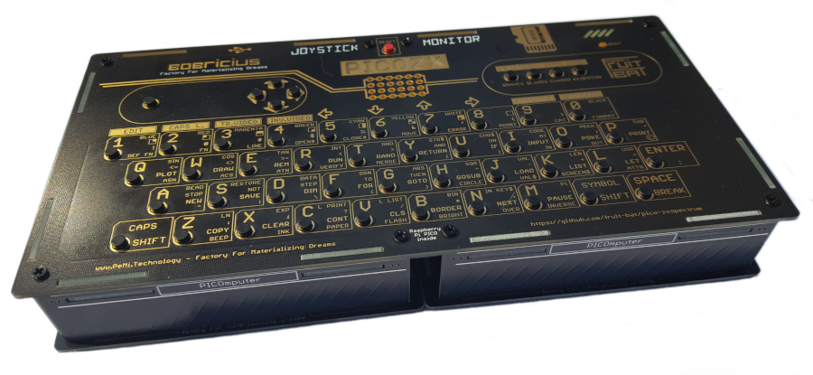
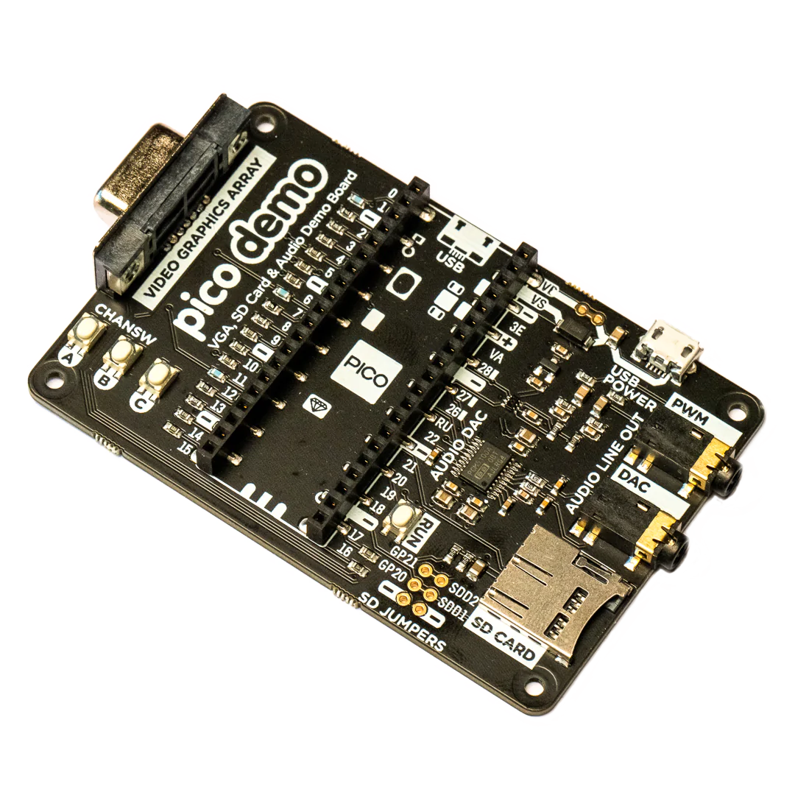
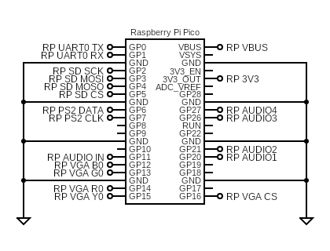
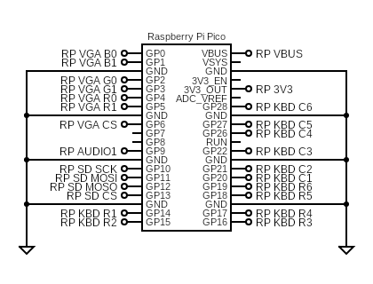
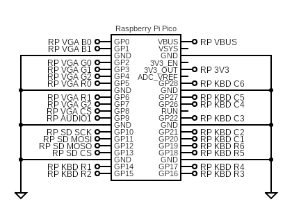
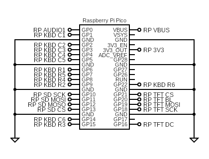
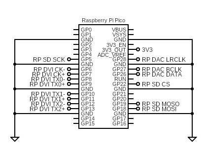
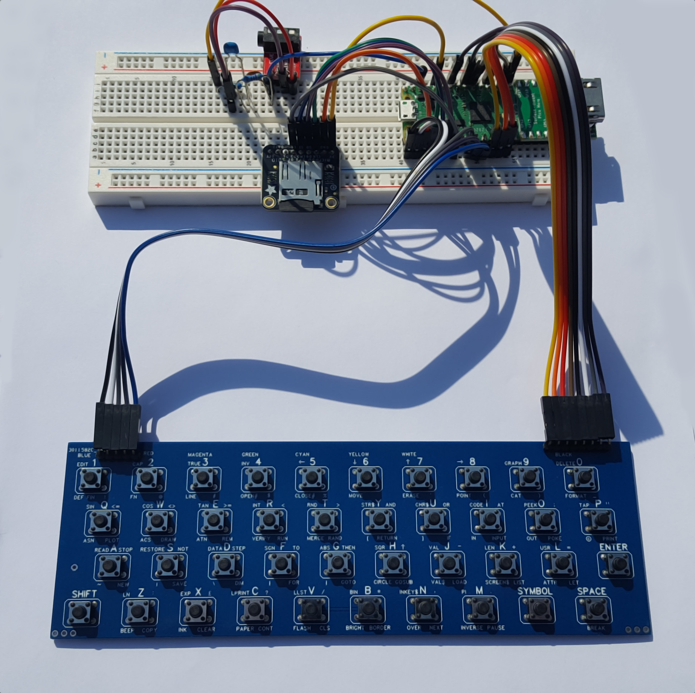
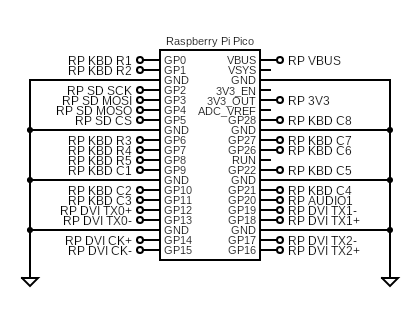
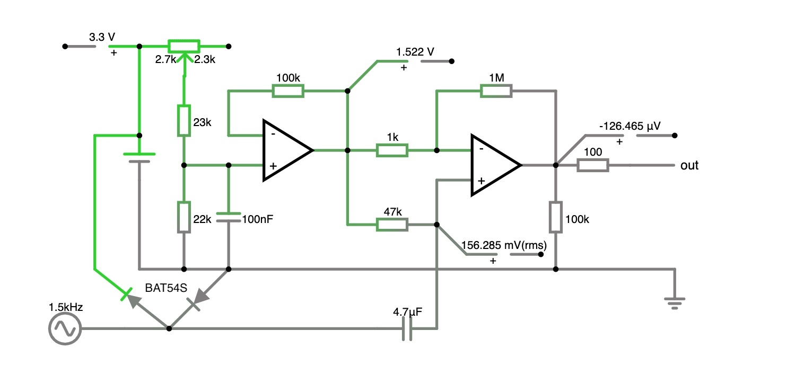

# pico-zxspectrum
48k/128k ZX Spectrum for Raspberry Pico Pi RP2040

<a href="docs/1280px-ZXSpectrum48k.jpg"></a><a href="docs/1280px-ZX_Spectrum128K.jpg"></a>

## Features
* DVI over HDMI ([Wren's Amazing PicoDVI](https://github.com/Wren6991/PicoDVI))
* LCD support (ST7789 320x240)
* VGA video (RGB332, RGB222, RGBY1111)
* USB keyboard & Joysticks
* PS/2 keyboard
* Martix keyboard
* PWM/I2S DAC audio for 48k buzzer and AY-3-8912
* Audio input (load from tape)
* 12 quick save slots
* Load from .z80 snapshot files
* Read from .tap & .tzx tape files
* On screen menu system
* Kempston and Sinclair joystick emulation

## Supported Boards
* Breadboard
* [PICOZX](https://hackaday.io/project/186039-pico-zx-spectrum-128k)
* [RetroVGA](https://hackaday.io/project/183398-retrovga-raspbery-pico-multi-retro-computer)
* PicomputerMax
* PicomputerZX
* [Pimoroni Pico DV Demo Base](https://shop.pimoroni.com/products/pimoroni-pico-dv-demo-base)

<a></a>
<a href="https://hackaday.io/project/186039-pico-zx-spectrum-128k"></a>
<a href="https://hackaday.io/project/183398-retrovga-raspbery-pico-multi-retro-computer"></a>
<a href="https://hackaday.io/project/183398-retrovga-raspbery-pico-multi-retro-computer"></a>
<a href="https://hackaday.io/project/183398-retrovga-raspbery-pico-multi-retro-computer"></a>
<a href="https://shop.pimoroni.com/products/pimoroni-pico-dv-demo-base"></a>
<a href="https://shop.pimoroni.com/products/pimoroni-pico-vga-demo-base"></a>

## Interesting projects
[Hermit Retro Products](https://mk-mk.facebook.com/hermitretro/)<br>

## Updates
* 13/11/22 - Slightly better PS/2 keyboard overflow handling
* 13/11/22 - Partial support for TZX tape format
* 24/09/22 - Fixed some problems with AY audio
* 23/09/22 - Added support for Pimoroni Pico VGA Demo Base
* 19/09/22 - Audio in (load from tape)
* 31/08/22 - Fix multiple Z80 self-test failures
* 27/08/22 - Fix for joysticks with single xy axis
* 13/08/22 - Added support for PICOZX
* 04/08/22 - Update wiring documentation
* 26/07/22 - Better quality 48k sound for 1 pin PWM and DAC
* 23/07/22 - Added target for Pico DV board
* 23/07/22 - Audio output via PCM 5100A DAC for Pico DV board
* 23/07/22 - Moved to Pimoroni FATFS to support Pimoroni Pico DV board
* 10/07/22 - Added basic support for PS/2 keyboards

TZX support added with some omissions:
* No CSW support (raise an issue if this is important to you)

Builds with an RP_AUDIO_IN pin can now load from tape. 
Preparing the audio signal will require a little extra circuitry and some examples will be added to this page.

The move from [Carl's no-OS-FatFS-SD-SPI-RPi-Pico](https://github.com/carlk3/no-OS-FatFS-SD-SPI-RPi-Pico) to 
[Pimoroni's FatFS](https://github.com/pimoroni/pimoroni-pico) was made as the SD card pins on the 
[Pimoroni Pico DV Demo Base](https://shop.pimoroni.com/products/pimoroni-pico-dv-demo-base) do not match up with the
RP2040 SPI harware support. The Pimoroni library has a PIO SPI driver, which gets around the problem.

## Screen shots


## Targets
Pre-built binary targets can be copied directly to a Pico Pi. 
They can be downloaded from the links in the table below or found in the uf2 folder.
Connect your Pico Pi with a USB cable, while holding down the program button:

| Board | Binary |
| ------ | -------- |
| HDMI breadboard | [ZxSpectrumBreadboardHdmi1PinAudio.uf2](uf2/ZxSpectrumBreadboardHdmi1PinAudio.uf2) |
| HDMI breadboard | [ZxSpectrumBreadboardHdmi2PinAudio.uf2](uf2/ZxSpectrumBreadboardHdmi2PinAudio.uf2) |
| HDMI breadboard | [ZxSpectrumBreadboardHdmi4PinAudio.uf2](uf2/ZxSpectrumBreadboardHdmi4PinAudio.uf2) |
| VGA breadboard | [ZxSpectrum4PinAudioVga1111Ps2.uf2](uf2/ZxSpectrum4PinAudioVga1111Ps2.uf2) | 
| PICOZX | [ZxSpectrumPicomputerVga222Zx.uf2](uf2/ZxSpectrumPicomputerVga222Zx.uf2) |
| RetroVGA | [ZxSpectrumPicocomputerVga.uf2](uf2/ZxSpectrumPicocomputerVga.uf2) |
| PicomputerMax | [ZxSpectrumPicocomputerMax.uf2](uf2/ZxSpectrumPicocomputerMax.uf2) |
| PicomputerZX | [ZxSpectrumPicocomputerZX.uf2](uf2/ZxSpectrumPicocomputerZX.uf2) |
| Pimoroni Pico DV | [ZxSpectrumPicoDv.uf2](uf2/ZxSpectrumPicoDv.uf2) |
| Pimoroni Pico VGA | [ZxSpectrumPicoVga.uf2](uf2/ZxSpectrumPicoVga.uf2) |
| HDMI + key matrix |  [ZxSpectrumBreadboardHdmiKbd1PinAudio.ufs](uf2/ZxSpectrumBreadboardHdmiKbd1PinAudio.uf2) |

e.g. for the HDMI breadboard wiring show above use:
```sh
cp ZxSpectrumBreadboardHdmi4PinAudio.uf2 /media/pi/RPI-RP2/
```

These targets are discussed in more detail in the following sections.

### ZxSpectrumBreadboardHdmiNPinAudio
This is a series of targets based around my original breadboard prototype:


The targets are: 
* ZxSpectrumBreadboardHdmi4PinAudio
* ZxSpectrumBreadboardHdmi2PinAudio
* ZxSpectrumBreadboardHdmi1PinAudio

They support the following:
* USB keyboard
* PS/2 keyboard
* USB joysticks
* HDMI video
* PWM sound
* Audio input (load from tape)
* SPI SD card
* Serial port debug

All of these targets share the same pinout but make different use of the 4 audio pins:


### ZxSpectrum4PinAudioVga1111Ps2
This is a target similar to the HDMI prototype which uses VGA video output.

It supports the following:
* USB keyboard
* PS/2 keyboard
* USB joysticks
* VGA video (RGBY1111)
* PWM sound (4 pin)
* SPI SD card
* Serial port debug

This target uses 4 audio pins:



### ZxSpectrumPicomputerVga222Zx
This is a target written for Bobricius' PICOZX

<a href="https://hackaday.io/project/186039-pico-zx-spectrum-128k"></a>

It supports:
* USB keyboard
* Keyboard martix
* USB joysticks
* VGA video (RGB222)
* PWM sound (1 pin)
* Audio input (load from tape)
* SPI SD card

Here are the pin assignments:



### ZxSpectrumPicomputerVga
This is the target for Bobricius' Retro VGA board:

<a href="https://hackaday.io/project/183398-retrovga-raspbery-pico-multi-retro-computer"></a>

It supports the following:
* USB keyboard
* USB joysticks
* Matrix keyboard (6x6)
* VGA video (RGB332)
* PWM sound (1 pin)
* SPI SD card

Here are the pin assignments:



### ZxSpectrumPicomputerMax & ZxSpectrumPicomputerZX
These are the targets for Bobricius' Retro PICOmputerMAX and PICOmputerZX.
The targets are very similar except the LCD on the PICOmputerZX has rounded corners and needs a different menu layout.

<a href="https://hackaday.io/project/183398-retrovga-raspbery-pico-multi-retro-computer"></a>
<a href="https://hackaday.io/project/183398-retrovga-raspbery-pico-multi-retro-computer"></a>

It supports the following:
* USB keyboard
* USB joysticks
* Matrix keyboard (6x6)
* LCD video (ST7789)
* PWM sound (1 pin)
* SPI SD card

Here are the pin assignments:



### ZxSpectrumPicoDv
This target matches the [Pimoroni Pico DV](https://shop.pimoroni.com/products/pimoroni-pico-dv-demo-base) board:

<a href="https://shop.pimoroni.com/products/pimoroni-pico-dv-demo-base"></a>

It supports the following:
* USB keyboard
* USB joysticks
* HDMI video
* I2S sound
* SPI SD card

Here are the pin assignments:



### ZxSpectrumBreadboardHdmiKbd1PinAudio
This is a target similar to the HDMI prototype which uses can read from an original Spectrum keyboard matrix.

It is a work in progress.

<a href=""></a>

It supports the following:
* USB keyboard
* Matrix keyboard (8x8)
* USB joysticks
* HDMI video
* PWM sound (1 pin)
* SPI SD card

Here are the pin assignments:



I don't know how the original keyboard pins were numbered but mine go from left to right with the keyboard oriented as you would type on it.

## Audio pins
There are two techniques for audio output. 
The first is a mixture of digital sound and PWM output, which comes in three variants.
The second is is using a DAC connected to the Pico using I2S.

### PWM/Digital Audio
PWM audio output comes in 3 variants 1, 2 and 4 pin:

| Label     | 1 Pin                  | 2 Pin               | 4 Pin                   |
| ----      | ---------------------- | ------------------- | ----------------------- |
| RP AUDIO1 | Buzzer & AY-3-8912 PWM | AY-3-8912 PWM       | AY-3-8912 Channel A PWM |
| RP AUDIO2  | -                      | Buzzer             | Buzzer                  |
| RP AUDIO3  | -                      | -                  | AY-3-8912 Channel B PWM |
| RP AUDIO4  | -                      | -                  | AY-3-8912 Channel C PWM |

High frequencies need to be filtered out of the PWM audio output and mixed with the Spectrum's digital audio.
Here are some sample designs. Please note they are not carefully designed but made from components I found lying around. 
If you create a particularly nice sounding design please let me know and I will add it to the documentation.

Separating out the Spectrum buzzer from the AY-3-8912 improves the fidelity of the Spectrum beeps.


The best audio is achieved by having separate pins for the Spectrum buzzer and AY-3-8912 A,B & C channels.


The sound is actually quite good from the 4 pin filter and at some point I will do a stero version. 

Designs that only have a single GPIO pin available can have the audio mixed digitally:


### I2S DAC Audio
The emulation can drive a PCM5100A DAC for line out audio over I2S.
It uses the RP_DAC_DATA, RP_DAC_BCLK and RP_DAC_LRCLK pin on the Pico.
Currently, only tested on the Pimoroni Pico DV board.

### Video output

#### DVI/HDMI
The following circuit shows roughly how to connect an HDMI socket; 
I have always used a breakout board... 

<a href="https://buyzero.de/products/raspberry-pi-pico-dvi-sock-videoausgabe-fur-den-pico">

</a>

<a href="https://thepihut.com/products/adafruit-dvi-breakout-board-for-hdmi-source-devices">

</a>

...but this is what I think it boils down to:


So far, there are three supported VGA configurations, which can be found in the various build targets.
They have all been designed with a combination of plagiarism and guesswork,
so please let me know if you have better versions and I will update this document.
#### VGA RGBY 1111
Although this is the most complicated, it is my favourite as it only uses 5 pins on the Pico. The display is slightly paler than the other two versions, which is easier on the eyes.


See this [CMakeLists.txt](src/vga/CMakeLists.txt) for an example configuration.
#### VGA RGB 222


See this [CMakeLists.txt](src/picomputer/picomputer_vga_zx/CMakeLists.txt) for an example configuration.
#### VGA RGB 332


See this [CMakeLists.txt](src/picomputer/picomputer_vga/CMakeLists.txt) for an example configuration.

### PS/2 Keyboards
The emulator targets can accept input from a PS/2 keyboard wired to RP_PS2_DATA and RP_PS2_CLK.
A suggested circuit is shown below:


The resistors and Zeners are there in case the keyboard contains a pull-up resistor to 5v on either the data or clock lines;
the data and clock lines are, in theory, open-collector with no pull-up.

I'm told most PS/2 keyboards can be run at 3.3v and the the extra components become redundant... but I've not tried with mine. 
You may find the Pico struggles to deliver enough power at 3.3v for the SD card writes and running a keyboard.

Currently there is no toggling on the lock keys (caps/num lock) and the indicator leds are not used.

### Audio Input

Due to a great deal of help from [badrianiulian](https://github.com/badrianiulian), here is a suggested audio input circuit:



Suggestions to improve this circuit are appreciated and please post them [here](https://github.com/fruit-bat/pico-zxspectrum/issues/46).

## Components 
<a href="https://shop.pimoroni.com/products/raspberry-pi-pico">

</a>

<a href="https://buyzero.de/products/raspberry-pi-pico-dvi-sock-videoausgabe-fur-den-pico">

</a>

<a href="https://thepihut.com/products/adafruit-dvi-breakout-board-for-hdmi-source-devices">

</a>

<a href="https://thepihut.com/products/adafruit-micro-sd-spi-or-sdio-card-breakout-board-3v-only">

</a>

<a href="https://shop.pimoroni.com/products/adafruit-stemma-speaker-plug-and-play-audio-amplifier">

</a>


### RetroVGA and Picomputer keyboard mappings
Trying to squeeze in all the key mappings is tricky but here is an attempt.

These are the nomal key mappings:<br/>
<br/>

These are the mappings with the ALt key down.:<br/>
<br/>
Shifted and numeric mappings are turned on and off using the arrow keys (up, down, left, right).
QS1, QS2, ...  save the emulator state to the appropriate Quick Save slot.

If there is a save in QS1 it will load after the emulator is powered-on or reset.

The SN keys load snapshots as if they are in a loop. 
SN loads the current snapshot, SN- load the previous snapshot and SN+ loads the next snapshot.

These are the mappings with the numeric shift on:<br/>
<br/>

Alt+V sets the arrow keys to behave like a Kempston joystick,
Alt+C sets the arrow keys to operate the Spectrum cursor keys.

### RetroVGA kiosk mode
Kiosk mode disables the menu system and quick-save buttons. 
Kiosk mode is enabled by placing the following file on the SD-card:
```bash
zxspectrum/kiosk.txt
```


### Pico pinout


## Issues
The Z80 is interrupted at the end of each frame at 60hz. The original Spectrum wrote frames at 50hz, so some code runs more frequently than it used to; there is a 4Mhz CPU setting that kind of balances this up.

There is now preliminary support for Kempston & Sinclair joysticks.

A USB hub can be connected to the RP2040 allowing a keyboard and joysticks to be used with the Spectrum. The code is a bit new and I don't know how many different joysticks will be supported; if you are having trouble raise an issue and attach a HID report descriptor from your device and I will have a look at it.

To get this to work I have done some hacking and slashing in [TinyUSB](https://github.com/hathach/tinyusb) (sorry Ha Thach): 

https://github.com/fruit-bat/tinyusb/tree/hid_micro_parser

*update*

Updates suggested by Ryzee119 are getting harder to merge into the latest code:

https://github.com/Ryzee119/tinyusb/tree/multi-hub

The combined efforts were here, but are now out of date:

https://github.com/fruit-bat/tinyusb/tree/hid_micro_parser_and_hub


## Build
The version of [TinyUSB](https://github.com/hathach/tinyusb) in the [Pico SDK](https://github.com/raspberrypi/pico-sdk)
will need to be replaced with a version containing a HID report parser and USB hub support.

Using *git* protocol:
```sh
cd $PICO_SDK_PATH/lib/
mv tinyusb tinyusb.orig
git clone git@github.com:fruit-bat/tinyusb.git
cd tinyusb
git checkout hid_micro_parser
```
...or using *https* protocol:
```sh
cd $PICO_SDK_PATH/lib/
mv tinyusb tinyusb.orig
git clone https://github.com/fruit-bat/tinyusb.git
cd tinyusb
git checkout hid_micro_parser
```

Make a folder in which to clone the required projects e.g.
```sh
mkdir ~/pico
cd ~/pico
```

Clone the projects from github:

Using *git* protocol:
```sh
git clone git@github.com:raspberrypi/pico-extras.git
git clone git@github.com:Wren6991/PicoDVI.git
git clone git@github.com:fruit-bat/pico-vga-332.git
git clone git@github.com:fruit-bat/pico-zxspectrum.git
git clone git@github.com:pimoroni/pimoroni-pico.git
git clone git@github.com:fruit-bat/pico-dvi-menu
git clone git@github.com:fruit-bat/pico-emu-utils

```
...or using *https* protocol:
```sh
git clone https://github.com/raspberrypi/pico-extras.git
git clone https://github.com/Wren6991/PicoDVI.git
git clone https://github.com/fruit-bat/pico-vga-332.git
git clone https://github.com/fruit-bat/pico-zxspectrum.git
git clone https://github.com/pimoroni/pimoroni-pico.git
git clone https://github.com/fruit-bat/pico-dvi-menu
git clone https://github.com/fruit-bat/pico-emu-utils
```
Edit:
```sh
pimoroni-pico/drivers/fatfs/ffconf.h
```
and set FF_USE_FIND to 1
```
#define FF_USE_FIND            1
```


Perform the build:
```sh
cd pico-zxspectrum
mkdir build
cd build
cmake -DPICO_COPY_TO_RAM=0 ..
make clean
make -j4
```

Building for the *Pimoroni Pico VGA Demo Base* needs a different cmake command:

```sh
cd build
cmake -DPICO_COPY_TO_RAM=0 -DPICO_BOARD=vgaboard ..
make -j4 ZxSpectrumPicoVga
```

Copy the relevant version to your board, which can be located with:
```sh
find . -name '*.uf2'
```
e.g.
```sh
cp ./bin/breadboard_hdmi/ZxSpectrumBreadboardHdmi.uf2 /media/pi/RPI-RP2/
```

## Prepare an SD card
The following folders need to be created on the SD card:

| Folder | Contents |
| ------ | -------- |
| zxspectrum/snapshots | Put your .z80 snapshot files in here. |
| zxspectrum/quicksaves | Folder for quick saves. |
| zxspectrum/tapes | Folder for .tap tape files. |

## Special keys

| Key | Action |
| --- | ------ |
| AltGr | Symbol |
| F1 | Toggle on screen menu |
| F3 | Toggle mute |
| F4 | Toggle the Z80 moderator. Cycles through 3.5Mhz, 4.0Mhz and unmoderated |
| F5 | play current tape |
| F6 | play previous tape |
| F7 | play next tape |
| F8 | Reload current snap |
| F9 | previous snap |
| F10 | next snap |
| F11 | Reset as 48k Spectrum |
| F12 | Reset as 128k Spectrum |
| LCtrl + F1-F12 | Quick save (LCtrl+F1 = save slot 1, LCtrl+F2 = save slot 2, etc) |
| LAlt + F1-F12 | Quick load (LAlt+F1 = load slot 1, LAlt+F2 = load slot 2, etc) |

## Debug
<a href="https://shop.pimoroni.com/products/usb-to-uart-serial-console-cable">

</a>

| Pico pin | Pico GPIO | Adapter wire |
| -------- | --------- | ------------ |
| 1        | GP0       | White        |
| 2        | GP1       | Green        |
| 3        | GND       | Black        |

```sh
tio -m ODELBS /dev/ttyUSB0
```
## Thanks to
[CarlK](https://github.com/carlk3/) for the super [no OS FAT FS for Pico](https://github.com/carlk3/no-OS-FatFS-SD-SPI-RPi-Pico)<br/>
[Damien G](https://damieng.com/) for maintaining and publishing some wonderful [8-bit fonts](https://damieng.com/typography/zx-origins/)<br/>
[Wren](https://github.com/Wren6991/) for the amazing [PicoDVI](https://github.com/Wren6991/PicoDVI)<br/>
[hathach](https://github.com/hathach) for the embeded USB library [TinyUSB](https://github.com/hathach/tinyusb)<br/>
[Lin Ke-Fong](https://github.com/anotherlin) for the [Z80 emulator](https://github.com/anotherlin/z80emu)<br/>
[Pimoroni](https://github.com/pimoroni/pimoroni-pico) for lots of useful libraries</br>
[badrianiulian](https://github.com/badrianiulian) for help testing and design work on the audio circuitry<br/>

## References
[Z80 Test suite](https://github.com/raxoft/z80test)<br/>
[Wren's Amazing PicoDVI](https://github.com/Wren6991/PicoDVI)<br/>
[Z80 file format documentation](https://worldofspectrum.org/faq/reference/z80format.htm)<br/>
[Fonts by DamienG](https://damieng.com/typography/zx-origins/)<br/>
[breakintoprogram - Screen memory layout](http://www.breakintoprogram.co.uk/computers/zx-spectrum/screen-memory-layout)<br/>
[breakintoprogram - keyboard layout](http://www.breakintoprogram.co.uk/computers/zx-spectrum/keyboard)<br/>
[breakintoprogram - interrupts](http://www.breakintoprogram.co.uk/computers/zx-spectrum/interrupts)<br/>
[worldofspectrum - 48k ZX Spectrum reference](https://worldofspectrum.org/faq/reference/48kreference.htm)<br/>
[worldofspectrum - 128k ZX Spectrum reference](https://worldofspectrum.org/faq/reference/128kreference.htm)<br/>
[worldofspectrum - AY-3-8912 reference](https://worldofspectrum.org/ZXSpectrum128Manual/sp128p13.html)<br/>
[JGH Spectrum ROM](http://mdfs.net/Software/Spectrum/Harston/)<br/>
[48k ZX Spectrum service manual](https://www.1000bit.it/support/manuali/sinclair/zxspectrum/sm/section1.html)<br/>
[GOSH ZX Spectrum ROM](https://k1.spdns.de/Vintage/Sinclair/82/Sinclair%20ZX%20Spectrum/ROMs/gw03%20'gosh%2C%20wonderful'%20(Geoff%20Wearmouth)/gw03%20info.htm)<br/>
[Cassette input circuit design](http://www.zxdesign.info/cassette.shtml)<br/>
[ZX Spectrum ROM Images](https://mdfs.net/Software/Spectrum/ROMImages/)<br/>
[AY-3-8912 - manual](https://cpctech.cpc-live.com/docs/ay38912/psgspec.htm)<br/>
[AY-3-8912 - synth](http://www.armory.com/~rstevew/Public/SoundSynth/Novelty/AY3-8910/start.html)<br/>
[USB HID 1.1](https://www.usb.org/sites/default/files/hid1_11.pdf)<br/>
[ST7789 LCD driver reference](docs/ST7789_Datasheet.pdf)<br/>
[RGB for 128k ZX Spectrum](docs/128_rgb.pdf)<br/>
[PS/2 vs HID keyboard codes](docs/ps2-hid.pdf)<br/>
[PCM 5100A DAC](PCM510xA.pdf)<br/>
[RP2040 Datasheet](https://datasheets.raspberrypi.com/rp2040/rp2040-datasheet.pdf)</br>
[Z80 Instruction set with XYH](https://wikiti.brandonw.net/?title=Z80_Instruction_Set)</br>
[Z80 Instruction set](https://clrhome.org/table/)</br>
[Site with some WAV files](http://zx.zigg.net/zxsoftware/)</br>
[ZX Modules Software](https://spectrumforeveryone.com/technical/zx-modules-software/)</br>
[TZX format](https://www.alessandrogrussu.it/tapir/tzxform120.html#GRPSTART)</br>
[A decoder for ZX format](https://github.com/kounch/playtzx)</br>
