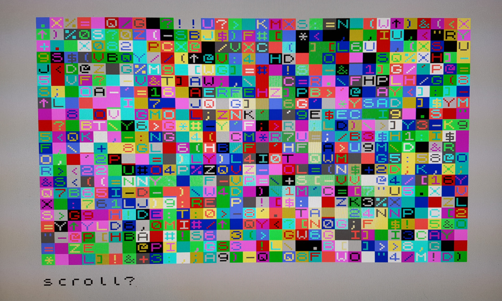
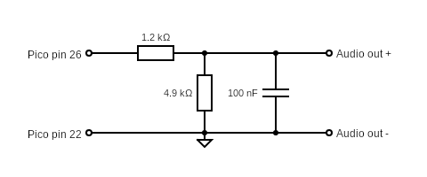

# pico-zxspectrum
48k/128k ZX Spectrum for Raspberry Pico Pi RP2040

  

This is a basic 48k/128k ZX Spectrum emulation on the RP2040 with DVI output.

Uses [Wren's Amazing PicoDVI](https://github.com/Wren6991/PicoDVI) and [CarlK's Super no OS FAT FS for Pico](https://github.com/carlk3/no-OS-FatFS-SD-SPI-RPi-Pico) libraries.

## Features
* DVI over HDMI output
* USB Keyboard input
* PWM sound for ear, mic and AY-3-8912
* 12 quick save slots
* Load from .z80 snapshot files
* Read from .tap tape files

## Screen shots

 

## Wiring

|       | SPI0  | GPIO  | Pin   | SPI       | MicroSD 0 | HDMI/DVI  |      Description       | 
| ----- | ----  | ----- | ---   | --------  | --------- | --------- | ---------------------- |
| MISO  | RX    | 4     | 6     | DO        | DO        |           | Master In, Slave Out   |
| CS0   | CSn   | 5     | 7     | SS or CS  | CS        |           | Slave (or Chip) Select |
| SCK   | SCK   | 2     | 4     | SCLK      | CLK       |           | SPI clock              |
| MOSI  | TX    | 3     | 5     | DI        | DI        |           | Master Out, Slave In   |
| CD    |       | 22    | 29    |           | CD        |           | Card Detect            |
| GND   |       |       | 3     |           | GND       |           | Ground                 |
| 3v3   |       |       | 36    |           | 3v3       |           | 3.3 volt power         |
| GND   |       |       | 18,23 |           |           | GND       | Ground                 |
| GP16  |       | 16    | 21    |           |           | TX2+      | Data channel 2+        |
| GP17  |       | 17    | 22    |           |           | TX2-      | Data channel 2-        |
| GP18  |       | 18    | 24    |           |           | TX1+      | Data channel 1+        |
| GP19  |       | 19    | 25    |           |           | TX1-      | Data channel 1-        |
| GP12  |       | 12    | 16    |           |           | TX0+      | Data channel 0+        |
| GP13  |       | 13    | 17    |           |           | TX0-      | Data channel 0-        |
| GP14  |       | 14    | 19    |           |           | TXC+      | Clock +                |
| GP15  |       | 15    | 20    |           |           | TXC-      | Clock -                |
| GP20  |       | 20    | 26    |           |           |           | PWM audio out          |


### Audio filter
It's a good idea to filter out high frequencies from the PWM audio output.
The following components were chosen as I found them in a draw... but it sounds ok.



## Components 
<a href="https://shop.pimoroni.com/products/raspberry-pi-pico">

</a>

<a href="https://buyzero.de/products/raspberry-pi-pico-dvi-sock-videoausgabe-fur-den-pico">

</a>

<a href="https://thepihut.com/products/adafruit-dvi-breakout-board-for-hdmi-source-devices">

</a>

<a href="https://thepihut.com/products/adafruit-micro-sd-spi-or-sdio-card-breakout-board-3v-only">

</a>
                                                                                                        
## Issues
The Z80 is interrupted at the end of each frame at 60hz. The original Spectrum wrote frames at 50hz, so some code runs more frequently than it used to.

It would be really nice to be able to use a USB hub and connect a joystick as well as a keyboard but currently only devices connected directly seems to work.
## Try it
A pre-built binary can be copied directly to a Pico Pi. Connect your Pico Pi with a USB cable, while holding down the program button, then:
```sh
cp ZxSpectrum.uf2 /media/pi/RPI-RP2/
```

## Build
The latest version of [TinyUSB](https://github.com/hathach/tinyusb) contains some useful patches,
in particular it allows the keyboard to be reconnected.
It is probably a good idea to update the version in [Pico SDK](https://github.com/raspberrypi/pico-sdk) to the latest.
```sh
cd $PICO_SDK_PATH
cd lib/tinyusb/
git checkout master
git pull
```

This code needs to be cloned into the 'apps' folder of the [PicoDVI](https://github.com/Wren6991/PicoDVI) library. 
```
cd PicoDVI/software/apps
git clone git@github.com:fruit-bat/pico-zxspectrum.git zxspectrum
git clone git@github.com:fruit-bat/no-OS-FatFS-SD-SPI-RPi-Pico.git
```

In the 'apps' folder add the following lines to CMakeLists.txt
```
add_subdirectory(zxspectrum)
add_subdirectory(no-OS-FatFS-SD-SPI-RPi-Pico/FatFs_SPI)
```
In the build folder:
```
cmake -DPICO_COPY_TO_RAM=0 ..
make clean
make -j4 ZxSpectrum
cp apps/zxspectrum/ZxSpectrum.uf2 /media/pi/RPI-RP2/
```
## Prepare an SD card
The following folders need to be created on the SD card:

| Folder | Contents |
| ------ | -------- |
| zxspectrum/snapshots | Put your .z80 snapshot files in here. |
| zxspectrum/quicksaves | Folder for quick saves. |
| zxspectrum/tapes | Folder for .tap tape files. |

## Special keys

| Key | Action |
| --- | ------ |
| AltGr | Symbol |
| F4 | Toggle the Z80 moderator. Cycles through 3.5Mhz, 4.0Mhz and unmoderated |
| F5 | play current tape |
| F6 | play previous tape |
| F7 | play next tape |
| F8 | Reload current snap |
| F9 | previous snap |
| F10 | next snap |
| F11 | Reset as 48k Spectrum |
| F12 | Reset as 128k Spectrum |
| LCtrl + F1-F12 | Quick save (LCtrl+F1 = save slot 1, LCtrl+F2 = save slot 2, etc) |
| LAlt + F1-F12 | Quick load (LAlt+F1 = load slot 1, LAlt+F2 = load slot 2, etc) |

## Missing features
* HUD
* Joystick input
* Audio input

## Debug
<a href="https://shop.pimoroni.com/products/usb-to-uart-serial-console-cable">

</a>

| Pico pin | Pico GPIO | Adapter wire |
| -------- | --------- | ------------ |
| 1        | GP0       | White        |
| 2        | GP1       | Green        |
| 3        | GND       | Black        |

```sh
tio -m ODELBS /dev/ttyUSB0
```

## References
[Wren's Amazing PicoDVI](https://github.com/Wren6991/PicoDVI)<br/>
[Z80 file format documentation](https://worldofspectrum.org/faq/reference/z80format.htm)<br/>
http://www.breakintoprogram.co.uk/computers/zx-spectrum/screen-memory-layout<br/>
http://www.breakintoprogram.co.uk/computers/zx-spectrum/keyboard<br/>
http://www.breakintoprogram.co.uk/computers/zx-spectrum/interrupts<br/>
http://mdfs.net/Software/Spectrum/Harston/<br/>
https://www.1000bit.it/support/manuali/sinclair/zxspectrum/sm/section1.html<br/>
https://k1.spdns.de/Vintage/Sinclair/82/Sinclair%20ZX%20Spectrum/ROMs/gw03%20'gosh%2C%20wonderful'%20(Geoff%20Wearmouth)/gw03%20info.htm<br/>
https://worldofspectrum.org/faq/reference/48kreference.htm<br/>
https://worldofspectrum.org/faq/reference/128kreference.htm<br/>
http://www.zxdesign.info/cassette.shtml<br/>
https://uelectronics.info/2015/03/21/zx-spectrum-and-loaders-part-one/<br/>
https://mdfs.net/Software/Spectrum/ROMImages/<br/>
https://worldofspectrum.org/ZXSpectrum128Manual/sp128p13.html<br/>
https://cpctech.cpc-live.com/docs/ay38912/psgspec.htm<br/>
http://www.armory.com/~rstevew/Public/SoundSynth/Novelty/AY3-8910/start.html<br/>
