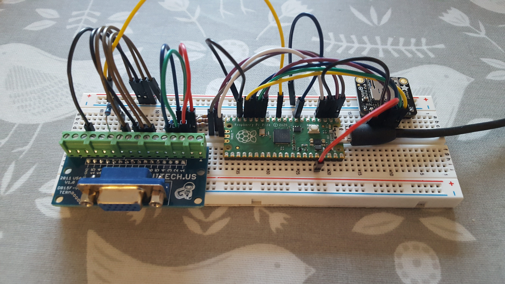
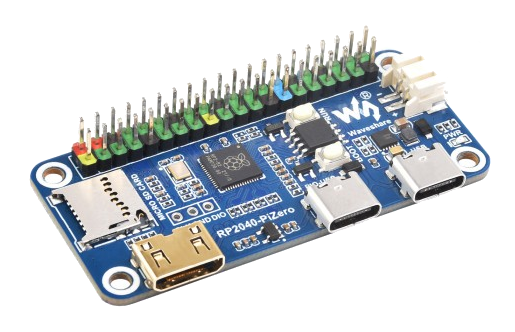
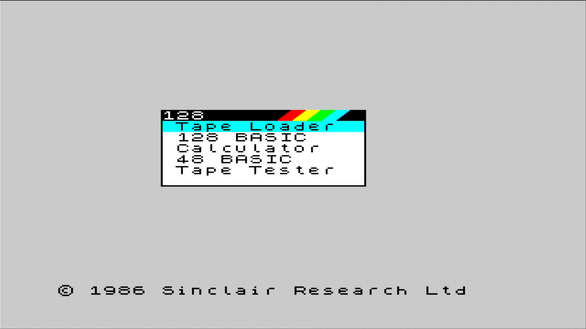
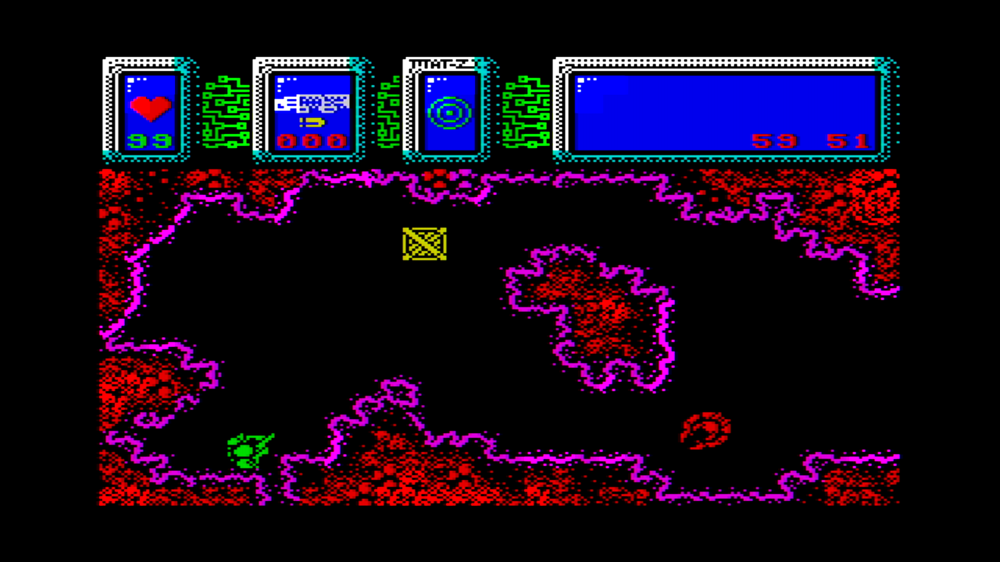
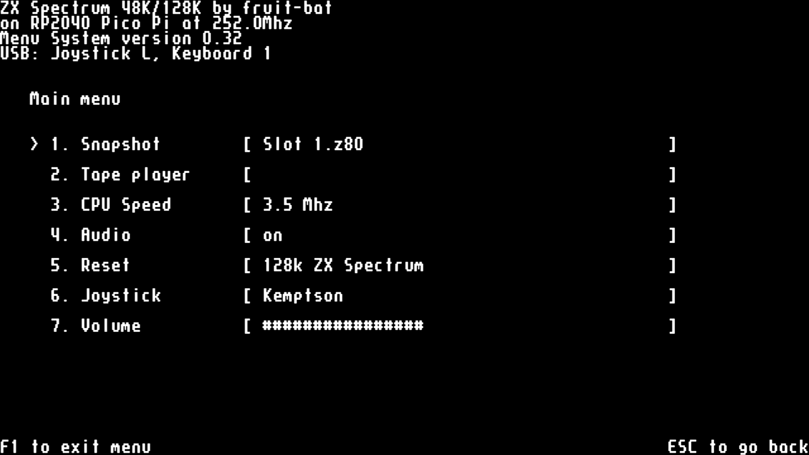
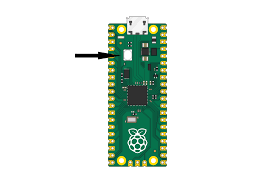

# pico-zxspectrum
48k/128k ZX Spectrum for Raspberry Pico Pi RP2040

<a href="docs/1280px-ZXSpectrum48k.jpg"></a><a href="docs/1280px-ZX_Spectrum128K.jpg"></a>

This project is intended to be relatively easy to breadboard or prototype in some other way. It's just for fun and not a highly accurate emulation; hopefully it is good enough to be enjoyable.

## Features
* DVI/HDMI ([Wren's Amazing PicoDVI](https://github.com/Wren6991/PicoDVI))
* LCD support (ST7789/ILI9341 320x240)
* VGA video (RGB332, RGB222, RGBY1111)
* USB keyboard & Joysticks
* PS/2 keyboard
* Martix keyboard
* HDMI/PWM/I2S DAC audio for 48k buzzer and AY-3-8912
* Audio input (load from tape)
* 12 quick save slots
* Load from .z80 snapshot files
* Read from .tap & .tzx tape files
* On screen menu system
* Kempston and Sinclair joystick emulation
* Kempston mouse emulation

## Updates
18/09/24

* Added support for NES/SNES joypads on MURMULATOR firmware

24/08/24

* Fixed USB joystick issue
* New support for Xinput joysticks thanks to [@DPRCZ](https://github.com/DPRCZ)
* Minor improvements to menu navigation
* Joystick buttons 2 & 4 together to access/exit menu

18/08/24

* Fixed an issue with keyboard input in some programs.

17/08/24

* Move to new VGA renderer (SDK update seems to have broken the old one)
Note that pico-extras needs to be the version from my site (https://github.com/fruit-bat/pico-extras)

11/08/24

* In menu Spectrum keyboard to aid joystick use thanks to [@DPRCZ](https://github.com/DPRCZ)

04/08/24

* USB joystick can now be used for menu navigation thanks to [@DPRCZ](https://github.com/DPRCZ)

22/07/24

* Added support for USB mouse to act as joystick, with settings in the menu. Thanks to [@javavi](https://github.com/javavi)
* Fixed an issue at with SD card access on startup; startup should be quicker and more reliable. Thanks to [@LiCaNtRoPo-PCB](https://github.com/LiCaNtRoPo-PCB)


[more...](docs/updates.md)

## Boards
Click on the images below for more information ...

<table>
  <tr>
    <td>
      <a href="docs/ZxSpectrumBreadboardHdmiKbd1PinAudio.md">

      </a>
    </td>
    <td>
      <a href="docs/ZxSpectrumBreadboardHdmiNPinAudio.md">
        
      </a>
      <a href="docs/ZxSpectrum4PinAudioVga1111Ps2.md">
        
      </a>
    </td>
  </tr>
</table>

<a href="docs/pico_zx48_128.md"></a>
<a href="docs/ZxSpectrumPicomputerZxLcd.md"></a>
<a href="docs/ZxSpectrumPicomputerVga222Zx.md"></a>
<a href="docs/ZxSpectrumPicomputerVga.md"></a>
<a href="docs/ZxSpectrumPicomputerMax.md"></a>
<a href="docs/ZxSpectrumPicomputerZX.md"></a>
<a href="docs/ZxSpectrumPicoDv.md"></a>
<a href="docs/ZxSpectrumPicoVga.md"></a>
<a href="docs/MURMULATOR.md"></a>
<a href="docs/ZxSpectrumPiZero.md">
</a>


| Board | Notes |
| ------ | -------- |
| [HDMI breadboard](docs/ZxSpectrumBreadboardHdmiNPinAudio.md) | Some breadboard HDMI options |
| [VGA breadboard](docs/ZxSpectrum4PinAudioVga1111Ps2.md) | Some breadboard VGA options | 
| [PICO ZX48/128](docs/pico_zx48_128.md) | ZX Spectrum 48K replacement board by Bobricius |
| [PICOZX LCD](docs/ZxSpectrumPicomputerZxLcd.md) | ZX Spectrum with LCD and VGA by Bobricius |
| [PICOZX](docs/ZxSpectrumPicomputerVga222Zx.md) | ZX Spectrum with VGA by Bobricius |
| [RetroVGA](docs/ZxSpectrumPicomputerVga.md) | VGA micro-computer by Bobricius |
| [PicomputerMax](docs/ZxSpectrumPicomputerMax.md) | LCD micro-computer by Bobricius |
| [PicomputerZX](docs/ZxSpectrumPicomputerZX.md) | ZX Spectrum with LCD by Bobricius |
| [Pimoroni Pico DV](docs/ZxSpectrumPicoDv.md) | Pimoroni's Pico DV board |
| [Pimoroni Pico VGA](docs/ZxSpectrumPicoVga.md) | Pimoroni's Pico VGA board |
| [HDMI + key matrix](docs/ZxSpectrumBreadboardHdmiKbd1PinAudio.md) | Breadboard with key matrix support |
| [ArnoldUK](docs/ZxSpectrumPicomputerVgaAuk.md) | Arnold UK's board |
| [MURMULATOR](docs/MURMULATOR.md) | Micro with VGA/HDMI and more |
| [RP2040-PiZero](docs/ZxSpectrumPiZero.md) | Waveshare RP2040-PiZero Development Board |

## Screen shots
      

## Audio samples
* [The Swarm - 4 pin PWM](docs/audio/the_swarm_pwm_4pin.mp3)
* [The Goblin - 4 pin PWM](docs/audio/the_goblin_pwm_4pin.mp3)

## Firmware targets
Pre-built binary targets can be copied directly to a Pico Pi. 
They can be downloaded from the links on the page for the board below or found in the uf2 folder.

Before attempting to update the firmware on your Pico make sure power supplies and any USB host devices have been disconnected (hub, keyboard, joysticks, etc.).

Push and hold the BOOTSEL button and plug your Pico into the USB port of your computer. Release the BOOTSEL button after your Pico is connected. It will mount as a Mass Storage Device called RPI-RP2. Drag and drop the UF2 file onto the RPI-RP2 volume.



On hardware with a faceplate the button is usually accessible through a small hole; the PICOZX Lcd board has the Pico facing inwards and you will need to reach a finger inside to press the bootsel button.

e.g. for the HDMI breadboard wiring show above use:
```sh
cp ZxSpectrumBreadboardHdmi4PinAudio.uf2 /media/pi/RPI-RP2/
```


## Audio output
There are three techniques for audio output. 
* A mixture of digital sound and PWM output, which comes in three variants.
* A DAC connected to the Pico using I2S.
* Audio over HDMI to the display.

### PWM/Digital Audio
PWM audio output comes in 3 variants, using 1, 2 and 4 pin:

| Label     | 1 Pin                  | 2 Pin               | 4 Pin                   |
| ----      | ---------------------- | ------------------- | ----------------------- |
| RP AUDIO1 | Buzzer & AY-3-8912 PWM | AY-3-8912 PWM       | AY-3-8912 Channel A PWM |
| RP AUDIO2  | -                      | Buzzer             | Buzzer                  |
| RP AUDIO3  | -                      | -                  | AY-3-8912 Channel B PWM |
| RP AUDIO4  | -                      | -                  | AY-3-8912 Channel C PWM |

High frequencies need to be filtered out of the PWM audio output and mixed with the Spectrum's digital audio.
Here are some sample designs. Please note they are not carefully designed but made from components I found lying around. 
If you create a particularly nice sounding design please let me know and I will add it to the documentation.

Separating out the Spectrum buzzer from the AY-3-8912 improves the fidelity of the Spectrum beeps.


The best audio is achieved by having separate pins for the Spectrum buzzer and AY-3-8912 A,B & C channels.


The sound is actually quite good from the 4 pin filter and at some point I will do a stero version. 

Designs that only have a single GPIO pin available can have the audio mixed digitally:


### I2S DAC Audio
The emulation can drive a PCM5100A DAC for line out audio over I2S.
It uses the RP_DAC_DATA, RP_DAC_BCLK and RP_DAC_LRCLK pin on the Pico.
Currently, only tested on the Pimoroni Pico DV board.

### HDMI audio 
HDMI builds can now output 44.1kHz audio to the display.

### Video output

#### DVI/HDMI
The following circuit shows roughly how to connect an HDMI socket; 
I have always used a breakout board... 

<a href="https://buyzero.de/products/raspberry-pi-pico-dvi-sock-videoausgabe-fur-den-pico">

</a>

<a href="https://thepihut.com/products/adafruit-dvi-breakout-board-for-hdmi-source-devices">

</a>

...but this is what I think it boils down to:


So far, there are three supported VGA configurations, which can be found in the various build targets.
They have all been designed with a combination of plagiarism and guesswork,
so please let me know if you have better versions and I will update this document.
#### VGA RGBY 1111
Although this is the most complicated, it is my favourite as it only uses 5 pins on the Pico. The display is slightly paler than the other two versions, which is easier on the eyes.


See this [CMakeLists.txt](src/vga/CMakeLists.txt) for an example configuration.
#### VGA RGB 222


See this [CMakeLists.txt](src/picomputer/picomputer_vga_zx/CMakeLists.txt) for an example configuration.
#### VGA RGB 332


See this [CMakeLists.txt](src/picomputer/picomputer_vga/CMakeLists.txt) for an example configuration.

### PS/2 Keyboards
The emulator targets can accept input from a PS/2 keyboard wired to RP_PS2_DATA and RP_PS2_CLK.
A suggested circuit is shown below:


The resistors and Zeners are there in case the keyboard contains a pull-up resistor to 5v on either the data or clock lines;
the data and clock lines are, in theory, open-collector with no pull-up.

I'm told most PS/2 keyboards can be run at 3.3v and the the extra components become redundant... but I've not tried with mine. 
You may find the Pico struggles to deliver enough power at 3.3v for the SD card writes and running a keyboard.

Currently there is no toggling on the lock keys (caps/num lock) and the indicator leds are not used.

### Audio Input

Due to a great deal of help from [badrianiulian](https://github.com/badrianiulian), here is a suggested audio input circuit:


Suggestions to improve this circuit are appreciated and please post them [here](https://github.com/fruit-bat/pico-zxspectrum/issues/46).

## Components 
<a href="https://shop.pimoroni.com/products/raspberry-pi-pico">

</a>

<a href="https://buyzero.de/products/raspberry-pi-pico-dvi-sock-videoausgabe-fur-den-pico">

</a>

<a href="https://thepihut.com/products/adafruit-dvi-breakout-board-for-hdmi-source-devices">

</a>

<a href="https://thepihut.com/products/adafruit-micro-sd-spi-or-sdio-card-breakout-board-3v-only">

</a>

<a href="https://shop.pimoroni.com/products/adafruit-stemma-speaker-plug-and-play-audio-amplifier">

</a>


### Pico pinout


### Display considerations
Firstly, the emulation does not have a screen buffer, and there is not enough RAM left to add one. Whichever dsiplay you use, it will not have exactly the same timing as the old PAL monitors. This is particularly noticable on 60Hz displays with programs on the Spectrum that try to synchronize their output with the display, or use the frame rate to control the speed of music. I'm gradually adding 50Hz modes to firmware for various boards. 

### Joysticks
There is basic support for connecting USB joysticks and have them appear as Kempston or Sinclair joysticks to the Spectrum.

For joysticks to work they have to provide a HID report, which is usually the case for generic PC joypads. Some manufacturers make joysticks that don't report their behaviour and hence require custom drivers; these are not going to work.

Basically, I don't know how many different joysticks will be usable. If you are having trouble raise an issue and attach a HID report descriptor from your device and I will have a look at it.

To get this to work I have done some hacking and slashing in [TinyUSB](https://github.com/hathach/tinyusb) (sorry Ha Thach): 

https://github.com/fruit-bat/tinyusb/tree/hid_micro_parser

## Build
The version of [TinyUSB](https://github.com/hathach/tinyusb) in the [Pico SDK](https://github.com/raspberrypi/pico-sdk)
will need to be replaced with a version containing a HID report parser and USB hub support.

Using *git* protocol:
```sh
cd $PICO_SDK_PATH/lib/
mv tinyusb tinyusb.orig
git clone git@github.com:fruit-bat/tinyusb.git
cd tinyusb
git checkout hid_micro_parser
```
...or using *https* protocol:
```sh
cd $PICO_SDK_PATH/lib/
mv tinyusb tinyusb.orig
git clone https://github.com/fruit-bat/tinyusb.git
cd tinyusb
git checkout hid_micro_parser
```

Make a folder in which to clone the required projects e.g.
```sh
mkdir ~/pico
cd ~/pico
```

Clone the projects from github:

Using *git* protocol:
```sh
git clone git@github.com:fruit-bat/pico-nespad.git
git clone git@github.com:fruit-bat/pico-extras.git
git clone git@github.com:fruit-bat/PicoDVI.git
git clone git@github.com:fruit-bat/pico-zxspectrum.git
git clone git@github.com:pimoroni/pimoroni-pico.git
git clone git@github.com:fruit-bat/pico-dvi-menu
git clone git@github.com:fruit-bat/pico-emu-utils
git clone git@github.com:redcode/Z80.git
git clone git@github.com:redcode/Zeta.git
```
...or using *https* protocol:
```sh
git clone https://github.com/fruit-bat/pico-nespad.git
git clone https://github.com/fruit-bat/pico-extras.git
git clone https://github.com/fruit-bat/PicoDVI.git
git clone https://github.com/fruit-bat/pico-zxspectrum.git
git clone https://github.com/pimoroni/pimoroni-pico.git
git clone https://github.com/fruit-bat/pico-dvi-menu
git clone https://github.com/fruit-bat/pico-emu-utils
git clone https://github.com/redcode/Z80.git
git clone https://github.com/redcode/Zeta.git
```
Edit:
```sh
pimoroni-pico/drivers/fatfs/ffconf.h
```
and set FF_USE_FIND to 1
```
#define FF_USE_FIND            1
```
Switch to the audio branch of PicoDVI
```sh
cd PicoDVI
git checkout audio
cd -
```

Perform the build:
```sh
cd pico-zxspectrum
mkdir build
cd build
```
If you have an RP2040
```
cmake -DPICO_COPY_TO_RAM=0 -DPICO_MCU=rp2040 ..
```
or if you have an RP2350
```
cmake -DPICO_COPY_TO_RAM=0 -DPICO_MCU=rp2350 ..
```
then
```
make clean
make -j4
```

Building for the *Pimoroni Pico VGA Demo Base* needs a different cmake command:

```sh
cd build
cmake -DPICO_COPY_TO_RAM=0 -DPICO_BOARD=vgaboard ..
make -j4 ZxSpectrumPicoVga
```

Copy the relevant version to your board, which can be located with:
```sh
find . -name '*.uf2'
```
e.g.
```sh
cp ./bin/breadboard_hdmi/ZxSpectrumBreadboardHdmi.uf2 /media/pi/RPI-RP2/
```

## Prepare an SD card
I have used the following SD card formats:

| |
| - |
| 2 GB FAT16 |
| 2 GB FAT32 |
| 4 GB W95 FAT32 (LBA) |

The table shows the folders used by the emulator on the SD card.
If not already present, they will be created as the emulator starts up.

| Folder | Contents |
| ------ | -------- |
| zxspectrum/snapshots | Put your .z80 snapshot files in here. |
| zxspectrum/snapshots/quicksaves | Folder for quick saves. |
| zxspectrum/tapes | Folder for .tap and .tzx tape files. |

## USB and PS2 Keyboard mappings

| Key | Action |
| --- | ------ |
| AltGr | Symbol |
| F1 | Toggle on screen menu |
| F3 | Toggle mute |
| F4 | Toggle the Z80 moderator. Cycles through 3.5Mhz, 4.0Mhz and unmoderated |
| F8 | Reload current snap |
| F9 | previous snap |
| F10 | next snap |
| F11 | Reset as 48k Spectrum |
| F12 | Reset as 128k Spectrum |
| LCtrl + F1-F12 | Quick save (LCtrl+F1 = save slot 1, LCtrl+F2 = save slot 2, etc) |
| LAlt + F1-F12 | Quick load (LAlt+F1 = load slot 1, LAlt+F2 = load slot 2, etc) |

## Debug
<a href="https://shop.pimoroni.com/products/usb-to-uart-serial-console-cable">

</a>

| Pico pin | Pico GPIO | Adapter wire |
| -------- | --------- | ------------ |
| 1        | GP0       | White        |
| 2        | GP1       | Green        |
| 3        | GND       | Black        |

```sh
tio -m ODELBS /dev/ttyUSB0
```
## Thanks to
[CarlK](https://github.com/carlk3/) for the super [no OS FAT FS for Pico](https://github.com/carlk3/no-OS-FatFS-SD-SPI-RPi-Pico)<br/>
[Damien G](https://damieng.com/) for maintaining and publishing some wonderful [8-bit fonts](https://damieng.com/typography/zx-origins/)<br/>
[Wren](https://github.com/Wren6991/) for the amazing [PicoDVI](https://github.com/Wren6991/PicoDVI)<br/>
[hathach](https://github.com/hathach) for the embeded USB library [TinyUSB](https://github.com/hathach/tinyusb)<br/>
[Lin Ke-Fong](https://github.com/anotherlin) for the [Z80 emulator](https://github.com/anotherlin/z80emu)<br/>
[Pimoroni](https://github.com/pimoroni/pimoroni-pico) for lots of useful libraries</br>
[badrianiulian](https://github.com/badrianiulian) for help testing and design work on the audio circuitry<br/>
[redcode](https://github.com/redcode/Z80) for the [Z80 emulator](https://github.com/redcode/Z80)<br/>
[Javavi](https://github.com/javavi) for adding support for the MURMULATOR platform <br/>
[ikjordan](https://github.com/ikjordan) for his audio additions to [PicoDVI](https://github.com/ikjordan/PicoDVI)

## References
[Z80 Test suite](https://github.com/raxoft/z80test)<br/>
[Wren's Amazing PicoDVI](https://github.com/Wren6991/PicoDVI)<br/>
[Z80 file format documentation](https://worldofspectrum.org/faq/reference/z80format.htm)<br/>
[Fonts by DamienG](https://damieng.com/typography/zx-origins/)<br/>
[breakintoprogram - Screen memory layout](http://www.breakintoprogram.co.uk/computers/zx-spectrum/screen-memory-layout)<br/>
[breakintoprogram - keyboard layout](http://www.breakintoprogram.co.uk/computers/zx-spectrum/keyboard)<br/>
[breakintoprogram - interrupts](http://www.breakintoprogram.co.uk/computers/zx-spectrum/interrupts)<br/>
[worldofspectrum - 48k ZX Spectrum reference](https://worldofspectrum.org/faq/reference/48kreference.htm)<br/>
[worldofspectrum - 128k ZX Spectrum reference](https://worldofspectrum.org/faq/reference/128kreference.htm)<br/>
[worldofspectrum - AY-3-8912 reference](https://worldofspectrum.org/ZXSpectrum128Manual/sp128p13.html)<br/>
[JGH Spectrum ROM](http://mdfs.net/Software/Spectrum/Harston/)<br/>
[48k ZX Spectrum service manual](https://www.1000bit.it/support/manuali/sinclair/zxspectrum/sm/section1.html)<br/>
[GOSH ZX Spectrum ROM](https://k1.spdns.de/Vintage/Sinclair/82/Sinclair%20ZX%20Spectrum/ROMs/gw03%20'gosh%2C%20wonderful'%20(Geoff%20Wearmouth)/gw03%20info.htm)<br/>
[Cassette input circuit design](http://www.zxdesign.info/cassette.shtml)<br/>
[ZX Spectrum ROM Images](https://mdfs.net/Software/Spectrum/ROMImages/)<br/>
[AY-3-8912 - manual](https://cpctech.cpc-live.com/docs/ay38912/psgspec.htm)<br/>
[AY-3-8912 - synth](http://www.armory.com/~rstevew/Public/SoundSynth/Novelty/AY3-8910/start.html)<br/>
[USB HID 1.1](https://www.usb.org/sites/default/files/hid1_11.pdf)<br/>
[ST7789 LCD driver reference](docs/ST7789_Datasheet.pdf)<br/>
[RGB for 128k ZX Spectrum](docs/128_rgb.pdf)<br/>
[PS/2 vs HID keyboard codes](docs/ps2-hid.pdf)<br/>
[PCM 5100A DAC](PCM510xA.pdf)<br/>
[RP2040 Datasheet](https://datasheets.raspberrypi.com/rp2040/rp2040-datasheet.pdf)</br>
[Z80 Instruction set with XYH](https://wikiti.brandonw.net/?title=Z80_Instruction_Set)</br>
[Z80 Instruction set](https://clrhome.org/table/)</br>
[Site with some WAV files](http://zx.zigg.net/zxsoftware/)</br>
[ZX Modules Software](https://spectrumforeveryone.com/technical/zx-modules-software/)</br>
[TZX format](https://www.alessandrogrussu.it/tapir/tzxform120.html#GRPSTART)</br>
[A decoder for ZX format](https://github.com/kounch/playtzx)</br>
[Circuit diagram editor](https://www.circuit-diagram.org/)</br>

## Interesting projects
[Hermit Retro Products](https://mk-mk.facebook.com/hermitretro/)<br>
