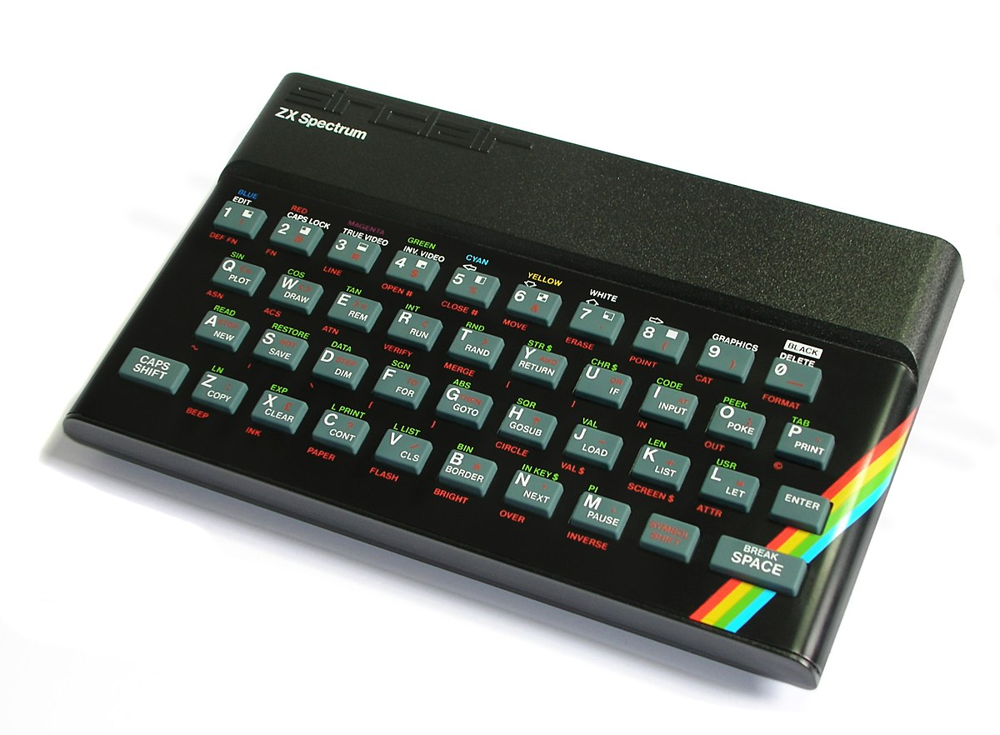
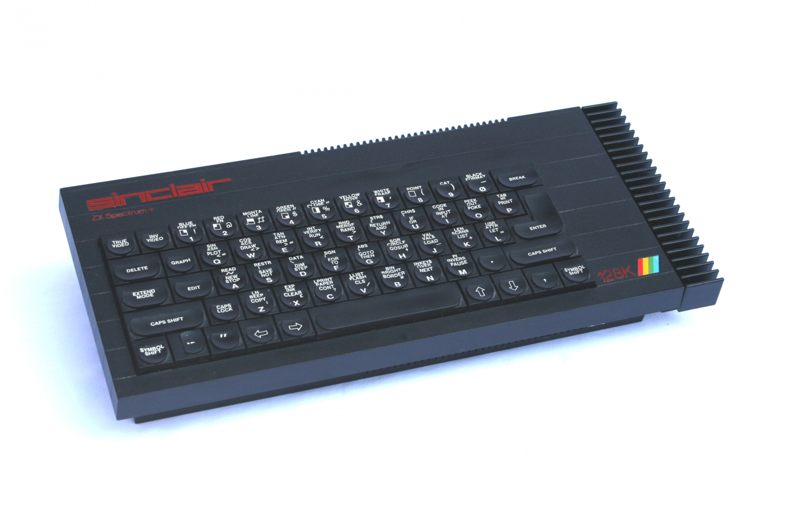
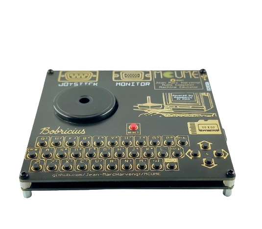
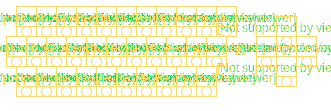
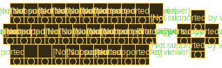
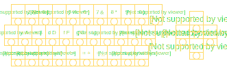
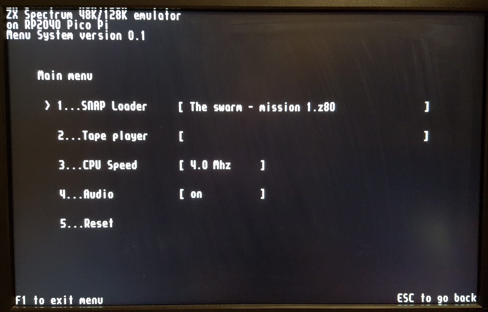
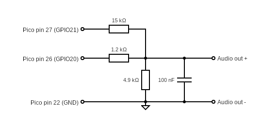
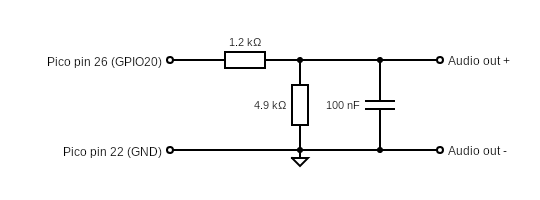

# pico-zxspectrum
48k/128k ZX Spectrum for Raspberry Pico Pi RP2040




This is a basic 48k/128k ZX Spectrum emulation on the RP2040 with DVI/LCD/VGA output.

Uses [Wren's Amazing PicoDVI](https://github.com/Wren6991/PicoDVI) and [CarlK's Super no OS FAT FS for Pico](https://github.com/carlk3/no-OS-FatFS-SD-SPI-RPi-Pico) libraries.

## Features
* DVI over HDMI/LCD/VGA video
* USB Keyboard & Joysticks
* PWM sound for ear, mic and AY-3-8912
* 12 quick save slots
* Load from .z80 snapshot files
* Read from .tap tape files
* On screen menu system
* Kempston and Sinclair joystick emulation

## Updates
* 12/06/222 - Much better sound with 2 pin audio output

## Experimental
* VGA output (RGB332)
* LCD output (ST7789 320x240)
* Support for [RetroVGA](https://hackaday.io/project/183398-retrovga-raspbery-pico-multi-retro-computer)
* Support for PicomputerMax
* Support for PicomputerZX
<a href="https://hackaday.io/project/183398-retrovga-raspbery-pico-multi-retro-computer">

</a>

### RetroVGA and Picomputer keyboard mappings
Trying to squeeze in all the key mappings is tricky but here is an attempt.

These are the nomal key mappings:<br/>
<br/>

These are the mappings with the ALt key down.:<br/>
<br/>
Shifted and numeric mappings are turned on and off using the arrow keys (up, down, left, right).
QS1, QS2, ...  save the emulator state to the appropriate Quick Save slot.

If there is a save in QS1 it will load after the emulator is powered-on or reset.

The SN keys load snapshots as if they are in a loop. 
SN loads the current snapshot, SN- load the previous snapshot and SN+ loads the next snapshot.

These are the mappings with the numeric shift on:<br/>
<br/>

### RetroVGA kiosk mode
Kiosk mode disables the menu system and quick-save buttons. 
Kiosk mode is enabled by placing the following file on the SD-card:
```bash
zxspectrum/kiosk.txt
```

## Screen shots




## Wiring

|       | SPI0  | GPIO  | Pin   | SPI       | MicroSD 0 | HDMI/DVI  |      Description       | 
| ----- | ----  | ----- | ---   | --------  | --------- | --------- | ---------------------- |
| MISO  | RX    | 4     | 6     | DO        | DO        |           | Master In, Slave Out   |
| CS0   | CSn   | 5     | 7     | SS or CS  | CS        |           | Slave (or Chip) Select |
| SCK   | SCK   | 2     | 4     | SCLK      | CLK       |           | SPI clock              |
| MOSI  | TX    | 3     | 5     | DI        | DI        |           | Master Out, Slave In   |
| CD    |       | 22    | 29    |           | CD        |           | Card Detect            |
| GND   |       |       | 3     |           | GND       |           | Ground                 |
| 3v3   |       |       | 36    |           | 3v3       |           | 3.3 volt power         |
| GND   |       |       | 18,23 |           |           | GND       | Ground                 |
| GP16  |       | 16    | 21    |           |           | TX2+      | Data channel 2+        |
| GP17  |       | 17    | 22    |           |           | TX2-      | Data channel 2-        |
| GP18  |       | 18    | 24    |           |           | TX1+      | Data channel 1+        |
| GP19  |       | 19    | 25    |           |           | TX1-      | Data channel 1-        |
| GP12  |       | 12    | 16    |           |           | TX0+      | Data channel 0+        |
| GP13  |       | 13    | 17    |           |           | TX0-      | Data channel 0-        |
| GP14  |       | 14    | 19    |           |           | TXC+      | Clock +                |
| GP15  |       | 15    | 20    |           |           | TXC-      | Clock -                |
| GP20  |       | 20    | 26    |           |           |           | PWM audio out          |
| GP21  |       | 21    | 27    |           |           |           | Digital audio out      |


### Prototype


### Audio filter
High frequencies need to be filtered out of the PWM audio output and mixed with the Spectrum's digital audio:



Designs that only have a single GPIO pin available can still have the audio mixed digitally:



## Components 
<a href="https://shop.pimoroni.com/products/raspberry-pi-pico">

</a>

<a href="https://buyzero.de/products/raspberry-pi-pico-dvi-sock-videoausgabe-fur-den-pico">

</a>

<a href="https://thepihut.com/products/adafruit-dvi-breakout-board-for-hdmi-source-devices">

</a>

<a href="https://thepihut.com/products/adafruit-micro-sd-spi-or-sdio-card-breakout-board-3v-only">

</a>

<a href="https://shop.pimoroni.com/products/adafruit-stemma-speaker-plug-and-play-audio-amplifier">

</a>

## Issues
The Z80 is interrupted at the end of each frame at 60hz. The original Spectrum wrote frames at 50hz, so some code runs more frequently than it used to; there is a 4Mhz CPU setting that kind of balances this up.

There is now preliminary support for Kempston & Sinclair joysticks.

A USB hub can be connected to the RP2040 allowing a keyboard and joysticks to be used with the Spectrum. The code is a bit new and I don't know how many different joysticks will be supported; if you are having trouble raise an issue and attach a HID report descriptor from your device and I will have a look at it.

To get this to work I have done some hacking and slashing in [TinyUSB](https://github.com/hathach/tinyusb) (sorry Ha Thach): 

https://github.com/fruit-bat/tinyusb/tree/hid_micro_parser

*update*

Updates suggested by Ryzee119 are getting harder to merge into the latest code:

https://github.com/Ryzee119/tinyusb/tree/multi-hub

The combined efforts were here, but are now out of date:

https://github.com/fruit-bat/tinyusb/tree/hid_micro_parser_and_hub


## Try it
A pre-built binary can be copied directly to a Pico Pi. Connect your Pico Pi with a USB cable, while holding down the program button.

For the wiring show above use:
```sh
cp ZxSpectrumBreadboardHdmi.uf2 /media/pi/RPI-RP2/
```
For the RetroVGA board use:
```sh
cp ZxSpectrumPicocomputerVga.uf2 /media/pi/RPI-RP2/
```
For the PicomputerMax board use:
```sh
cp ZxSpectrumPicocomputerMax.uf2 /media/pi/RPI-RP2/
```
For the PicomputerZX board use:
```sh
cp ZxSpectrumPicocomputerZX.uf2 /media/pi/RPI-RP2/
```
## Build
The version of [TinyUSB](https://github.com/hathach/tinyusb) in the [Pico SDK](https://github.com/raspberrypi/pico-sdk)
will need to be replaced with a version containing a HID report parser and USB hub support.

Using *git* protocol:
```sh
cd $PICO_SDK_PATH/lib/
mv tinyusb tinyusb.orig
git clone git@github.com:fruit-bat/tinyusb.git
cd tinyusb
git checkout hid_micro_parser
```
...or using *https* protocol:
```sh
cd $PICO_SDK_PATH/lib/
mv tinyusb tinyusb.orig
git clone https://github.com/fruit-bat/tinyusb.git
cd tinyusb
git checkout hid_micro_parser
```

Make a folder in which to clone the required projects e.g.
```sh
mkdir ~/pico
cd ~/pico
```

Clone the projects from github:

Using *git* protocol:
```sh
git clone git@github.com:raspberrypi/pico-extras.git
git clone git@github.com:Wren6991/PicoDVI.git
git clone git@github.com:fruit-bat/pico-vga-332.git
git clone git@github.com:fruit-bat/pico-zxspectrum.git
git clone git@github.com:fruit-bat/no-OS-FatFS-SD-SPI-RPi-Pico.git
git clone git@github.com:fruit-bat/pico-dvi-menu
git clone git@github.com:fruit-bat/pico-emu-utils

```
...or using *https* protocol:
```sh
git clone https://github.com/raspberrypi/pico-extras.git
git clone https://github.com/Wren6991/PicoDVI.git
git clone https://github.com/fruit-bat/pico-vga-332.git
git clone https://github.com/fruit-bat/pico-zxspectrum.git
git clone https://github.com/fruit-bat/no-OS-FatFS-SD-SPI-RPi-Pico.git
git clone https://github.com/fruit-bat/pico-dvi-menu
git clone https://github.com/fruit-bat/pico-emu-utils
```

Perform the build:
```sh
cd pico-zxspectrum
mkdir build
cd build
cmake -DPICO_COPY_TO_RAM=0 ..
make clean
make -j4
```

Copy the relevant version to your board:
```sh
cp ./bin/picomputer/picomputer_vga/ZxSpectrumPicomputerVga.uf2 /media/pi/RPI-RP2/
```
```sh
cp ./bin/picomputer/picomputer_max/ZxSpectrumPicomputerMax.uf2 /media/pi/RPI-RP2/
```
or
```sh
cp ./bin/breadboard_hdmi/ZxSpectrumBreadboardHdmi.uf2 /media/pi/RPI-RP2/
```

## Prepare an SD card
The following folders need to be created on the SD card:

| Folder | Contents |
| ------ | -------- |
| zxspectrum/snapshots | Put your .z80 snapshot files in here. |
| zxspectrum/quicksaves | Folder for quick saves. |
| zxspectrum/tapes | Folder for .tap tape files. |

## Special keys

| Key | Action |
| --- | ------ |
| AltGr | Symbol |
| F1 | Toggle on screen menu |
| F4 | Toggle the Z80 moderator. Cycles through 3.5Mhz, 4.0Mhz and unmoderated |
| F5 | play current tape |
| F6 | play previous tape |
| F7 | play next tape |
| F8 | Reload current snap |
| F9 | previous snap |
| F10 | next snap |
| F11 | Reset as 48k Spectrum |
| F12 | Reset as 128k Spectrum |
| LCtrl + F1-F12 | Quick save (LCtrl+F1 = save slot 1, LCtrl+F2 = save slot 2, etc) |
| LAlt + F1-F12 | Quick load (LAlt+F1 = load slot 1, LAlt+F2 = load slot 2, etc) |

## Missing features
* Audio input

## Debug
<a href="https://shop.pimoroni.com/products/usb-to-uart-serial-console-cable">

</a>

| Pico pin | Pico GPIO | Adapter wire |
| -------- | --------- | ------------ |
| 1        | GP0       | White        |
| 2        | GP1       | Green        |
| 3        | GND       | Black        |

```sh
tio -m ODELBS /dev/ttyUSB0
```
## Thanks to
[CarlK](https://github.com/carlk3/) for the super [no OS FAT FS for Pico](https://github.com/carlk3/no-OS-FatFS-SD-SPI-RPi-Pico)<br/>
[Damien G](https://damieng.com/) for maintaining and publishing some wonderful [8-bit fonts](https://damieng.com/typography/zx-origins/)<br/>
[Wren](https://github.com/Wren6991/) for the amazing [PicoDVI](https://github.com/Wren6991/PicoDVI)<br/>
[hathach](https://github.com/hathach) for the embeded USB library [TinyUSB](https://github.com/hathach/tinyusb)<br/>
[Lin Ke-Fong](https://github.com/anotherlin) for the [Z80 emulator](https://github.com/anotherlin/z80emu)<br/>

## References
[Wren's Amazing PicoDVI](https://github.com/Wren6991/PicoDVI)<br/>
[Z80 file format documentation](https://worldofspectrum.org/faq/reference/z80format.htm)<br/>
[Fonts by DamienG](https://damieng.com/typography/zx-origins/)<br/>
http://www.breakintoprogram.co.uk/computers/zx-spectrum/screen-memory-layout<br/>
http://www.breakintoprogram.co.uk/computers/zx-spectrum/keyboard<br/>
http://www.breakintoprogram.co.uk/computers/zx-spectrum/interrupts<br/>
http://mdfs.net/Software/Spectrum/Harston/<br/>
https://www.1000bit.it/support/manuali/sinclair/zxspectrum/sm/section1.html<br/>
https://k1.spdns.de/Vintage/Sinclair/82/Sinclair%20ZX%20Spectrum/ROMs/gw03%20'gosh%2C%20wonderful'%20(Geoff%20Wearmouth)/gw03%20info.htm<br/>
https://worldofspectrum.org/faq/reference/48kreference.htm<br/>
https://worldofspectrum.org/faq/reference/128kreference.htm<br/>
http://www.zxdesign.info/cassette.shtml<br/>
https://uelectronics.info/2015/03/21/zx-spectrum-and-loaders-part-one/<br/>
https://mdfs.net/Software/Spectrum/ROMImages/<br/>
https://worldofspectrum.org/ZXSpectrum128Manual/sp128p13.html<br/>
https://cpctech.cpc-live.com/docs/ay38912/psgspec.htm<br/>
http://www.armory.com/~rstevew/Public/SoundSynth/Novelty/AY3-8910/start.html<br/>
[USB HID 1.1](https://www.usb.org/sites/default/files/hid1_11.pdf)<br/>
