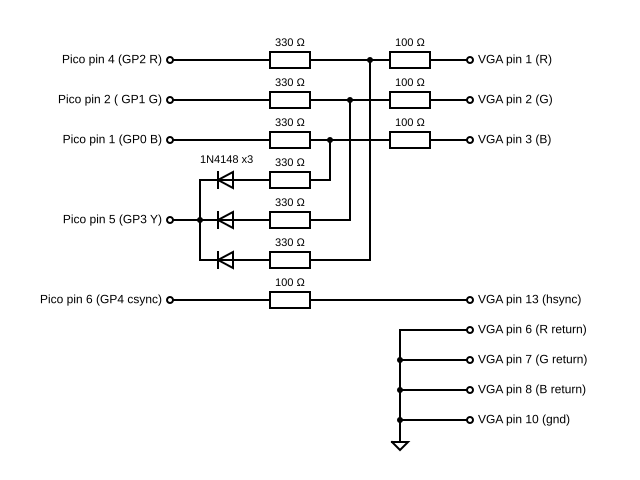

# pico-zxspectrum
48k/128k ZX Spectrum for Raspberry Pico Pi RP2040

<a href="docs/1280px-ZXSpectrum48k.jpg"></a><a href="docs/1280px-ZX_Spectrum128K.jpg"></a>

This is a basic 48k/128k ZX Spectrum emulation on the RP2040 with DVI/LCD/VGA output.

Uses [Wren's Amazing PicoDVI](https://github.com/Wren6991/PicoDVI) and [CarlK's Super no OS FAT FS for Pico](https://github.com/carlk3/no-OS-FatFS-SD-SPI-RPi-Pico) libraries.

## Features
* DVI over HDMI
* LCD support (ST7789 320x240)
* VGA video (RGB332, RGB222, RGBY1111)
* USB Keyboard & Joysticks
* PS/2 Keyboard
* PWM/I2S DAC audio for ear, mic and AY-3-8912
* 12 quick save slots
* Load from .z80 snapshot files
* Read from .tap tape files
* On screen menu system
* Kempston and Sinclair joystick emulation

## Supported Boards
* Breadboard
* [RetroVGA](https://hackaday.io/project/183398-retrovga-raspbery-pico-multi-retro-computer)
* PicomputerMax
* PicomputerZX
* [Pimoroni Pico DV Demo Base](https://shop.pimoroni.com/products/pimoroni-pico-dv-demo-base)

<a></a>
<a href="https://hackaday.io/project/183398-retrovga-raspbery-pico-multi-retro-computer"></a>
<a href="https://hackaday.io/project/183398-retrovga-raspbery-pico-multi-retro-computer"></a>
<a href="https://hackaday.io/project/183398-retrovga-raspbery-pico-multi-retro-computer"></a>
<a href="https://shop.pimoroni.com/products/pimoroni-pico-dv-demo-base"></a>
</a>


## Updates
* 23/07/22 - Added target for Pico DV board
* 23/07/22 - Audio output via PCM 5100A DAC for Pico DV board
* 23/07/22 - Moved to Pimoroni FATFS to support Pimoroni Pico DV board
* 10/07/22 - Added basic support for PS/2 keyboards
* 27/06/22 - Added support for RGB222 and RGBY1111 over VGA
* 22/06/22 - Even better sound with 4 pin audio output (HDMI version only)
* 18/06/22 - Don't freeze if SD card missing
* 12/06/22 - Much better sound with 2 pin audio output (HDMI version only)

## Screen shots


## Wiring

### General
|       | SPI0  | GPIO  | Pin   | SPI       | MicroSD 0 | HDMI/DVI  |      Description       | 
| ----- | ----  | ----- | ---   | --------  | --------- | --------- | ---------------------- |
| MISO  | RX    | 4     | 6     | DO        | DO        |           | Master In, Slave Out   |
| CS0   | CSn   | 5     | 7     | SS or CS  | CS        |           | Slave (or Chip) Select |
| SCK   | SCK   | 2     | 4     | SCLK      | CLK       |           | SPI clock              |
| MOSI  | TX    | 3     | 5     | DI        | DI        |           | Master Out, Slave In   |
| CD    |       | 22    | 29    |           | CD        |           | Card Detect            |
| GND   |       |       | 3     |           | GND       |           | Ground                 |
| 3v3   |       |       | 36    |           | 3v3       |           | 3.3 volt power         |
| GND   |       |       | 18,23 |           |           | GND       | Ground                 |
| GP16  |       | 16    | 21    |           |           | TX2+      | Data channel 2+        |
| GP17  |       | 17    | 22    |           |           | TX2-      | Data channel 2-        |
| GP18  |       | 18    | 24    |           |           | TX1+      | Data channel 1+        |
| GP19  |       | 19    | 25    |           |           | TX1-      | Data channel 1-        |
| GP12  |       | 12    | 16    |           |           | TX0+      | Data channel 0+        |
| GP13  |       | 13    | 17    |           |           | TX0-      | Data channel 0-        |
| GP14  |       | 14    | 19    |           |           | TXC+      | Clock +                |
| GP15  |       | 15    | 20    |           |           | TXC-      | Clock -                |
| GP20  |       | 20    | 26    |           |           |           | PWM audio out          |
| GP21  |       | 21    | 27    |           |           |           | Buzzer audio out       |
| GP26  |       | 26    | 31    |           |           |           | PWM audio out          |
| GP27  |       | 26    | 32    |           |           |           | PWM audio out          |
| GP6   |       | 6     | 9     |           |           |           | PS/2 keyboard data     |
| GP7   |       | 7     | 10    |           |           |           | PS/2 keyboard clock    |


### Audio pins
Audio output comes in 3 variants 1, 2 and 4 pin:

| GPIO | Pin | 1 Pin                  | 2 Pin               | 4 Pin                   |
| ---- | --- | ---------------------- | ------------------- | ----------------------- |
| GP20 | 26  | Buzzer & AY-3-8912 PWM | AY-3-8912 PWM       | AY-3-8912 Channel A PWM |
| GP21 | 27  | -                      | Buzzer              | Buzzer                  |
| GP26 | 31  | -                      | -                   | AY-3-8912 Channel B PWM |
| GP27 | 32  | -                      | -                   | AY-3-8912 Channel C PWM |

### Pico pinout


### Prototype


### Audio filter

High frequencies need to be filtered out of the PWM audio output and mixed with the Spectrum's digital audio.
Here are some sample designs. Please note they are not carefully designed but made from components I found lying around. 
If you create a particularly nice sounding design please let me know and I will add it to the documentation.

Separating out the Spectrum buzzer from the AY-3-8912 improves the fidelity of the Spectrum beeps.


The best audio is achieved by having separate pins for the Spectrum buzzer and AY-3-8912 A,B & C channels.


Designs that only have a single GPIO pin available can have the audio mixed digitally:


### VGA Support
So far, there are three supported VGA configurations, which can be found in the various build targets.
They have all been designed with a combination of plagiarism and guesswork,
so please let me know if you have better versions and I will update this document.
#### RGBY 1111
Although this is the most complicated, it is my favourite as it only uses 5 pins on the Pico. The display is slightly paler than the other two versions, which is easier on the eyes.



See this [CMakeLists.txt](src/picomputer/picomputer_vga_zx/CMakeLists.txt) for an example configuration.
#### RGB 222


See this [CMakeLists.txt](src/picomputer/picomputer_vga_zx/CMakeLists.txt) for an example configuration.
#### RGB 332


See this [CMakeLists.txt](src/picomputer/picomputer_vga/CMakeLists.txt) for an example configuration.

### PS/2 Keyboards
The emulator can accept input from a PS/2 keyboard wired to GP6 and GP7.
A suggested circuit is shown below:


The resistors and Zeners are there in case the keyboard contains a pull-up resistor to 5v on either the data or clock lines;
the data and clock lines are, in theory, open-collector with no pull-up.

I'm told most PS/2 keyboards can be run at 3.3v and the the extra components become redundant... but I've not tried with mine. 
You may find the Pico struggles to deliver enough power at 3.3v for the SD card writes and running a keyboard.

Currently there is no toggling on the lock keys (caps/num lock) and the indicator leds are not used.

## Components 
<a href="https://shop.pimoroni.com/products/raspberry-pi-pico">

</a>

<a href="https://buyzero.de/products/raspberry-pi-pico-dvi-sock-videoausgabe-fur-den-pico">

</a>

<a href="https://thepihut.com/products/adafruit-dvi-breakout-board-for-hdmi-source-devices">

</a>

<a href="https://thepihut.com/products/adafruit-micro-sd-spi-or-sdio-card-breakout-board-3v-only">

</a>

<a href="https://shop.pimoroni.com/products/adafruit-stemma-speaker-plug-and-play-audio-amplifier">

</a>


### RetroVGA and Picomputer keyboard mappings
Trying to squeeze in all the key mappings is tricky but here is an attempt.

These are the nomal key mappings:<br/>
<br/>

These are the mappings with the ALt key down.:<br/>
<br/>
Shifted and numeric mappings are turned on and off using the arrow keys (up, down, left, right).
QS1, QS2, ...  save the emulator state to the appropriate Quick Save slot.

If there is a save in QS1 it will load after the emulator is powered-on or reset.

The SN keys load snapshots as if they are in a loop. 
SN loads the current snapshot, SN- load the previous snapshot and SN+ loads the next snapshot.

These are the mappings with the numeric shift on:<br/>
<br/>

Alt+V sets the arrow keys to behave like a Kempston joystick,
Alt+C sets the arrow keys to operate the Spectrum cursor keys.

### RetroVGA kiosk mode
Kiosk mode disables the menu system and quick-save buttons. 
Kiosk mode is enabled by placing the following file on the SD-card:
```bash
zxspectrum/kiosk.txt
```

## Issues
The Z80 is interrupted at the end of each frame at 60hz. The original Spectrum wrote frames at 50hz, so some code runs more frequently than it used to; there is a 4Mhz CPU setting that kind of balances this up.

There is now preliminary support for Kempston & Sinclair joysticks.

A USB hub can be connected to the RP2040 allowing a keyboard and joysticks to be used with the Spectrum. The code is a bit new and I don't know how many different joysticks will be supported; if you are having trouble raise an issue and attach a HID report descriptor from your device and I will have a look at it.

To get this to work I have done some hacking and slashing in [TinyUSB](https://github.com/hathach/tinyusb) (sorry Ha Thach): 

https://github.com/fruit-bat/tinyusb/tree/hid_micro_parser

*update*

Updates suggested by Ryzee119 are getting harder to merge into the latest code:

https://github.com/Ryzee119/tinyusb/tree/multi-hub

The combined efforts were here, but are now out of date:

https://github.com/fruit-bat/tinyusb/tree/hid_micro_parser_and_hub


## Try it
Pre-built binaries can be copied directly to a Pico Pi. Connect your Pico Pi with a USB cable, while holding down the program button.

| Board | Binary | Audio |
| ------ | -------- | ----- |
| HDMI breadboard | ZxSpectrumBreadboardHdmi1PinAudio.uf2 | Digially mixed PWM audio |
| HDMI breadboard | ZxSpectrumBreadboardHdmi2PinAudio.uf2 | Buzzer pin and digially mixed AY-3-8912 PWM audio |
| HDMI breadboard | ZxSpectrumBreadboardHdmi4PinAudio.uf2 | Buzzer pin and separate PWM pins for AY-3-8912 A, B & C channles |
| RetroVGA | ZxSpectrumPicocomputerVga.uf2 | Digially mixed PWM audio |
| PicomputerMax | ZxSpectrumPicocomputerMax.uf2 | Digially mixed PWM audio |
| PicomputerZX | ZxSpectrumPicocomputerZX.uf2 | Digially mixed PWM audio |

e.g. for the HDMI breadboard wiring show above use:
```sh
cp ZxSpectrumBreadboardHdmi.uf2 /media/pi/RPI-RP2/
```

## Build
The version of [TinyUSB](https://github.com/hathach/tinyusb) in the [Pico SDK](https://github.com/raspberrypi/pico-sdk)
will need to be replaced with a version containing a HID report parser and USB hub support.

Using *git* protocol:
```sh
cd $PICO_SDK_PATH/lib/
mv tinyusb tinyusb.orig
git clone git@github.com:fruit-bat/tinyusb.git
cd tinyusb
git checkout hid_micro_parser
```
...or using *https* protocol:
```sh
cd $PICO_SDK_PATH/lib/
mv tinyusb tinyusb.orig
git clone https://github.com/fruit-bat/tinyusb.git
cd tinyusb
git checkout hid_micro_parser
```

Make a folder in which to clone the required projects e.g.
```sh
mkdir ~/pico
cd ~/pico
```

Clone the projects from github:

Using *git* protocol:
```sh
git clone git@github.com:raspberrypi/pico-extras.git
git clone git@github.com:Wren6991/PicoDVI.git
git clone git@github.com:fruit-bat/pico-vga-332.git
git clone git@github.com:fruit-bat/pico-zxspectrum.git
git clone git@github.com:carlk3/no-OS-FatFS-SD-SPI-RPi-Pico.git
git clone git@github.com:fruit-bat/pico-dvi-menu
git clone git@github.com:fruit-bat/pico-emu-utils

```
...or using *https* protocol:
```sh
git clone https://github.com/raspberrypi/pico-extras.git
git clone https://github.com/Wren6991/PicoDVI.git
git clone https://github.com/fruit-bat/pico-vga-332.git
git clone https://github.com/fruit-bat/pico-zxspectrum.git
git clone https://github.com/carlk3/no-OS-FatFS-SD-SPI-RPi-Pico.git
git clone https://github.com/fruit-bat/pico-dvi-menu
git clone https://github.com/fruit-bat/pico-emu-utils
```

Perform the build:
```sh
cd pico-zxspectrum
mkdir build
cd build
cmake -DPICO_COPY_TO_RAM=0 ..
make clean
make -j4
```

Copy the relevant version to your board:
```sh
cp ./bin/picomputer/picomputer_vga/ZxSpectrumPicomputerVga.uf2 /media/pi/RPI-RP2/
```
```sh
cp ./bin/picomputer/picomputer_max/ZxSpectrumPicomputerMax.uf2 /media/pi/RPI-RP2/
```
or
```sh
cp ./bin/breadboard_hdmi/ZxSpectrumBreadboardHdmi.uf2 /media/pi/RPI-RP2/
```

## Prepare an SD card
The following folders need to be created on the SD card:

| Folder | Contents |
| ------ | -------- |
| zxspectrum/snapshots | Put your .z80 snapshot files in here. |
| zxspectrum/quicksaves | Folder for quick saves. |
| zxspectrum/tapes | Folder for .tap tape files. |

## Special keys

| Key | Action |
| --- | ------ |
| AltGr | Symbol |
| F1 | Toggle on screen menu |
| F3 | Toggle mute |
| F4 | Toggle the Z80 moderator. Cycles through 3.5Mhz, 4.0Mhz and unmoderated |
| F5 | play current tape |
| F6 | play previous tape |
| F7 | play next tape |
| F8 | Reload current snap |
| F9 | previous snap |
| F10 | next snap |
| F11 | Reset as 48k Spectrum |
| F12 | Reset as 128k Spectrum |
| LCtrl + F1-F12 | Quick save (LCtrl+F1 = save slot 1, LCtrl+F2 = save slot 2, etc) |
| LAlt + F1-F12 | Quick load (LAlt+F1 = load slot 1, LAlt+F2 = load slot 2, etc) |

## Missing features
* Audio input

## Debug
<a href="https://shop.pimoroni.com/products/usb-to-uart-serial-console-cable">

</a>

| Pico pin | Pico GPIO | Adapter wire |
| -------- | --------- | ------------ |
| 1        | GP0       | White        |
| 2        | GP1       | Green        |
| 3        | GND       | Black        |

```sh
tio -m ODELBS /dev/ttyUSB0
```
## Thanks to
[CarlK](https://github.com/carlk3/) for the super [no OS FAT FS for Pico](https://github.com/carlk3/no-OS-FatFS-SD-SST7789_Datasheet.pdfPI-RPi-Pico)<br/>
[Damien G](https://damieng.com/) for maintaining and publishing some wonderful [8-bit fonts](https://damieng.com/typography/zx-origins/)<br/>
[Wren](https://github.com/Wren6991/) for the amazing [PicoDVI](https://github.com/Wren6991/PicoDVI)<br/>
[hathach](https://github.com/hathach) for the embeded USB library [TinyUSB](https://github.com/hathach/tinyusb)<br/>
[Lin Ke-Fong](https://github.com/anotherlin) for the [Z80 emulator](https://github.com/anotherlin/z80emu)<br/>

## References
[Wren's Amazing PicoDVI](https://github.com/Wren6991/PicoDVI)<br/>
[Z80 file format documentation](https://worldofspectrum.org/faq/reference/z80format.htm)<br/>
[Fonts by DamienG](https://damieng.com/typography/zx-origins/)<br/>
[breakintoprogram - Screen memory layout](http://www.breakintoprogram.co.uk/computers/zx-spectrum/screen-memory-layout)<br/>
[breakintoprogram - keyboard layout](http://www.breakintoprogram.co.uk/computers/zx-spectrum/keyboard)<br/>
[breakintoprogram - interrupts](http://www.breakintoprogram.co.uk/computers/zx-spectrum/interrupts)<br/>
[worldofspectrum - 48k ZX Spectrum reference](https://worldofspectrum.org/faq/reference/48kreference.htm)<br/>
[worldofspectrum - 128k ZX Spectrum reference](https://worldofspectrum.org/faq/reference/128kreference.htm)<br/>
[worldofspectrum - AY-3-8912 reference](https://worldofspectrum.org/ZXSpectrum128Manual/sp128p13.html)<br/>
[JGH Spectrum ROM](http://mdfs.net/Software/Spectrum/Harston/)<br/>
[48k ZX Spectrum service manual](https://www.1000bit.it/support/manuali/sinclair/zxspectrum/sm/section1.html)<br/>
[GOSH ZX Spectrum ROM](https://k1.spdns.de/Vintage/Sinclair/82/Sinclair%20ZX%20Spectrum/ROMs/gw03%20'gosh%2C%20wonderful'%20(Geoff%20Wearmouth)/gw03%20info.htm)<br/>
[Cassette input circuit design](http://www.zxdesign.info/cassette.shtml)<br/>
[ZX Spectrum ROM Images](https://mdfs.net/Software/Spectrum/ROMImages/)<br/>
[AY-3-8912 - manual](https://cpctech.cpc-live.com/docs/ay38912/psgspec.htm)<br/>
[AY-3-8912 - synth](http://www.armory.com/~rstevew/Public/SoundSynth/Novelty/AY3-8910/start.html)<br/>
[USB HID 1.1](https://www.usb.org/sites/default/files/hid1_11.pdf)<br/>
[ST7789 LCD driver reference](docs/ST7789_Datasheet.pdf)<br/>
[RGB for 128k ZX Spectrum](docs/128_rgb.pdf)<br/>
[PS/2 vs HID keyboard codes](docs/ps2-hid.pdf)<br/>
[PCM 5100A DAC](PCM510xA.pdf)<br/>
[RP2040 Datasheet](https://datasheets.raspberrypi.com/rp2040/rp2040-datasheet.pdf)</br>
