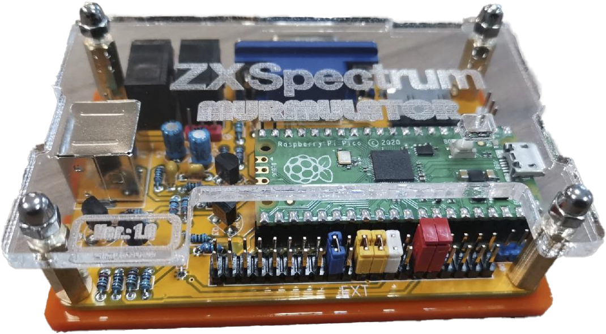
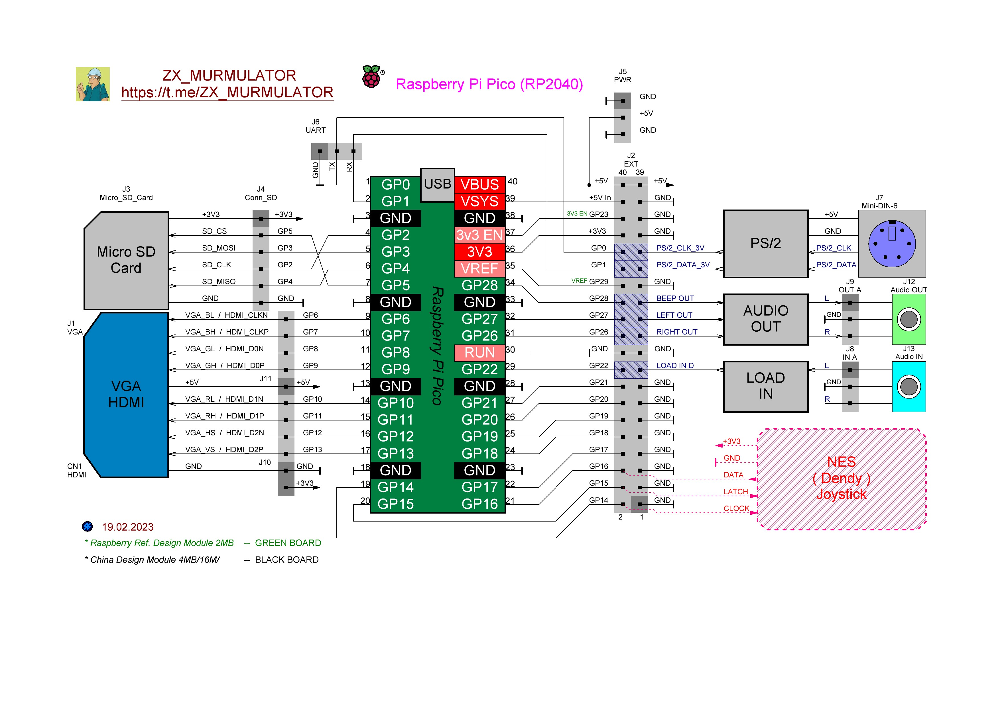
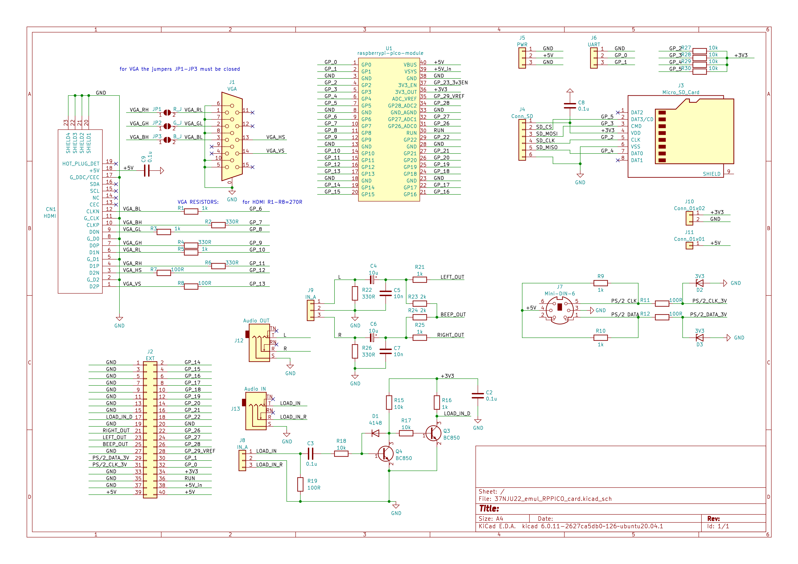

### MURMULATOR platform
There are variants of this board for VGA and HDMI output.

#### Circuit diagrams
 

#### Firmware
| Video | Audio | Display mode | Firmware |
| - | - | - | - |
| HDMI | HDMI | 720x576x50Hz | [ZX-MURMULATOR_HDMI_HDMI_AUDIO_720x576x50Hz.uf2](uf2/ZX-MURMULATOR_HDMI_HDMI_AUDIO_720x576x50Hz.uf2) |
| HDMI | PWM   | 720x576x50Hz | [ZX-MURMULATOR_HDMI_PWM_AUDIO_720x576x50Hz.uf2](uf2/ZX-MURMULATOR_HDMI_PWM_AUDIO_720x576x50Hz.uf2) |
| HDMI | HDMI | 640x480x60Hz | [ZX-MURMULATOR_HDMI_HDMI_AUDIO_640x480x60Hz.uf2](uf2/ZX-MURMULATOR_HDMI_HDMI_AUDIO_640x480x60Hz.uf2) |
| HDMI | PWM   | 640x480x60Hz | [ZX-MURMULATOR_HDMI_PWM_AUDIO_640x480x60Hz.uf2](uf2/ZX-MURMULATOR_HDMI_PWM_AUDIO_640x480x60Hz.uf2) |
| VGA | PWM    | 720x576x50Hz |[ZX-MURMULATOR_VGA_720x576x50Hz.uf2](uf2/ZX-MURMULATOR_VGA_720x576x50Hz.uf2) |
| VGA | PWM    | 640x480x60Hz |[ZX-MURMULATOR_VGA_640x480x60Hz.uf2](uf2/ZX-MURMULATOR_VGA_640x480x60Hz.uf2) |

#### References
[YouTube](https://www.youtube.com/watch?v=yE_ELX6RpBc) 
