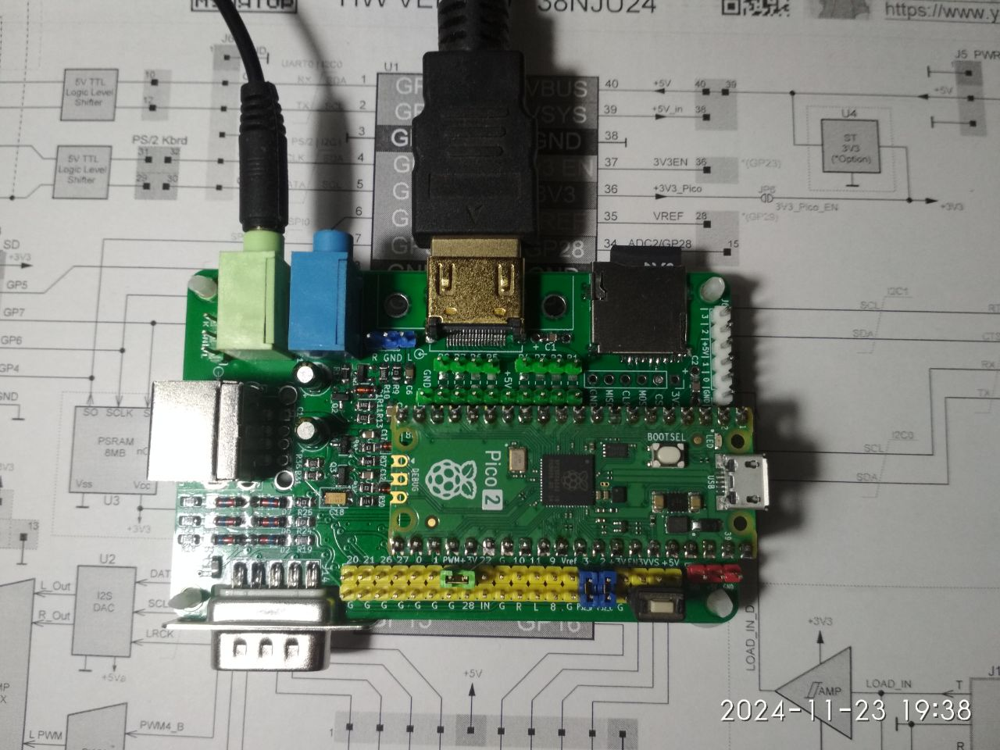
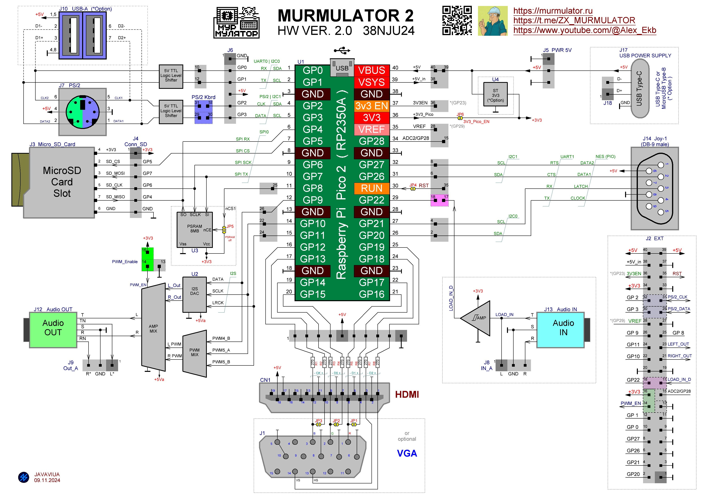
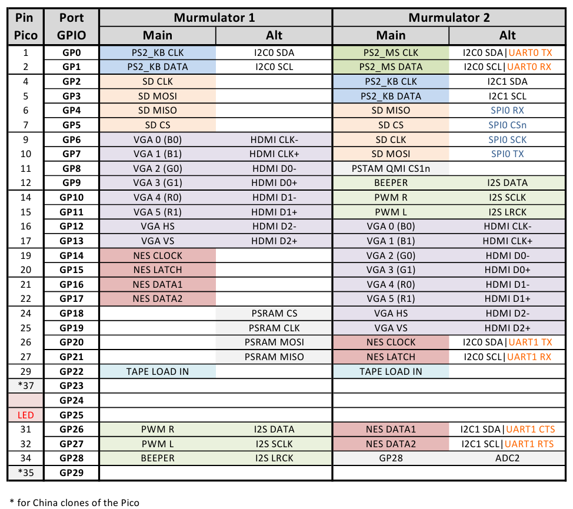

### MURMULATOR2 platform

#### Circuit diagram

#### Pin assignments

#### Firmware
| Video | Audio | Display mode | Firmware Pico | Firmware Pico2 |
| - | - | - | - | - |
| HDMI | HDMI  | 720x576x50Hz | [ZX-MURMULATOR2_HDMI_HDMI_AUDIO_720x576x50Hz.uf2](/uf2-rp2040/ZX-MURMULATOR2_HDMI_HDMI_AUDIO_720x576x50Hz.uf2) | [ZX-MURMULATOR2_HDMI_HDMI_AUDIO_720x576x50Hz.uf2](/uf2-rp2350-arm-s/ZX-MURMULATOR2_HDMI_HDMI_AUDIO_720x576x50Hz.uf2) |
| HDMI | PWM   | 720x576x50Hz | [ZX-MURMULATOR2_HDMI_PWM_AUDIO_720x576x50Hz.uf2](/uf2-rp2040/ZX-MURMULATOR2_HDMI_PWM_AUDIO_720x576x50Hz.uf2) | [ZX-MURMULATOR2_HDMI_PWM_AUDIO_720x576x50Hz.uf2](/uf2-rp2350-arm-s/ZX-MURMULATOR2_HDMI_PWM_AUDIO_720x576x50Hz.uf2) |
| HDMI | I2S   | 720x576x50Hz | [ZX-MURMULATOR2_HDMI_I2S_AUDIO_720x576x50Hz.uf2](/uf2-rp2040/ZX-MURMULATOR2_HDMI_I2S_AUDIO_720x576x50Hz.uf2) | [ZX-MURMULATOR2_HDMI_I2S_AUDIO_720x576x50Hz.uf2](/uf2-rp2350-arm-s/ZX-MURMULATOR2_HDMI_I2S_AUDIO_720x576x50Hz.uf2) |
| HDMI | HDMI  | 640x480x60Hz | [ZX-MURMULATOR2_HDMI_HDMI_AUDIO_640x480x60Hz.uf2](/uf2-rp2040/ZX-MURMULATOR2_HDMI_HDMI_AUDIO_640x480x60Hz.uf2) | [ZX-MURMULATOR2_HDMI_HDMI_AUDIO_640x480x60Hz.uf2](/uf2-rp2350-arm-s/ZX-MURMULATOR2_HDMI_HDMI_AUDIO_640x480x60Hz.uf2) |
| HDMI | PWM   | 640x480x60Hz | [ZX-MURMULATOR2_HDMI_PWM_AUDIO_640x480x60Hz.uf2](/uf2-rp2040/ZX-MURMULATOR2_HDMI_PWM_AUDIO_640x480x60Hz.uf2) | [ZX-MURMULATOR2_HDMI_PWM_AUDIO_640x480x60Hz.uf2](/uf2-rp2350-arm-s/ZX-MURMULATOR2_HDMI_PWM_AUDIO_640x480x60Hz.uf2) |
| HDMI | I2S   | 640x480x60Hz | [ZX-MURMULATOR2_HDMI_I2S_AUDIO_640x480x60Hz.uf2](/uf2-rp2040/ZX-MURMULATOR2_HDMI_I2S_AUDIO_640x480x60Hz.uf2) | [ZX-MURMULATOR2_HDMI_I2S_AUDIO_640x480x60Hz.uf2](/uf2-rp2350-arm-s/ZX-MURMULATOR2_HDMI_I2S_AUDIO_640x480x60Hz.uf2) |
| VGA | PWM    | 720x576x50Hz |[ZX-MURMULATOR2_VGA_PWM_AUDIO_720x576x50Hz.uf2](/uf2-rp2040/ZX-MURMULATOR2_VGA_PWM_AUDIO_720x576x50Hz.uf2) | [ZX-MURMULATOR2_VGA_PWM_AUDIO_720x576x50Hz.uf2](/uf2-rp2350-arm-s/ZX-MURMULATOR2_VGA_PWM_AUDIO_720x576x50Hz.uf2) |
| VGA | I2S    | 720x576x50Hz |[ZX-MURMULATOR2_VGA_I2S_AUDIO_720x576x50Hz.uf2](/uf2-rp2040/ZX-MURMULATOR2_VGA_I2S_AUDIO_720x576x50Hz.uf2) | [ZX-MURMULATOR2_VGA_I2S_AUDIO_720x576x50Hz.uf2](/uf2-rp2350-arm-s/ZX-MURMULATOR2_VGA_I2S_AUDIO_720x576x50Hz.uf2) |
| VGA | PWM    | 640x480x60Hz |[ZX-MURMULATOR2_VGA_PWM_AUDIO_640x480x60Hz.uf2](/uf2-rp2040/ZX-MURMULATOR2_VGA_PWM_AUDIO_640x480x60Hz.uf2) | [ZX-MURMULATOR2_VGA_PWM_AUDIO_640x480x60Hz.uf2](/uf2-rp2350-arm-s/ZX-MURMULATOR2_VGA_PWM_AUDIO_640x480x60Hz.uf2) |
| VGA | I2S    | 640x480x60Hz |[ZX-MURMULATOR2_VGA_I2S_AUDIO_640x480x60Hz.uf2](/uf2-rp2040/ZX-MURMULATOR2_VGA_I2S_AUDIO_640x480x60Hz.uf2) | [ZX-MURMULATOR2_VGA_I2S_AUDIO_640x480x60Hz.uf2](/uf2-rp2350-arm-s/ZX-MURMULATOR2_VGA_I2S_AUDIO_640x480x60Hz.uf2) |

#### References
