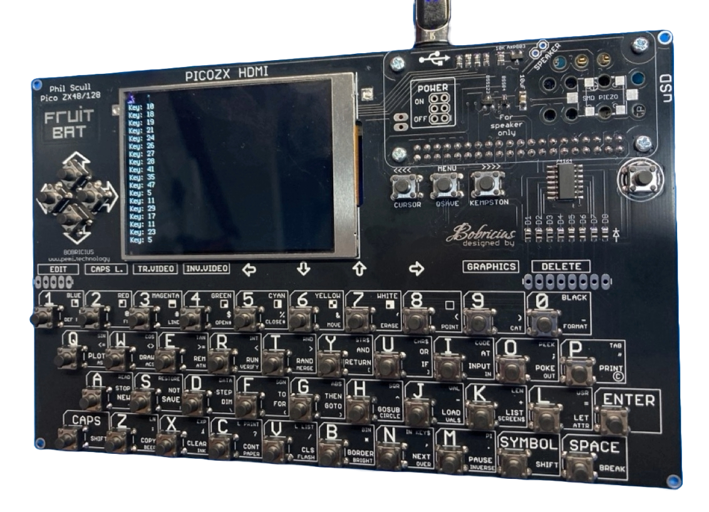
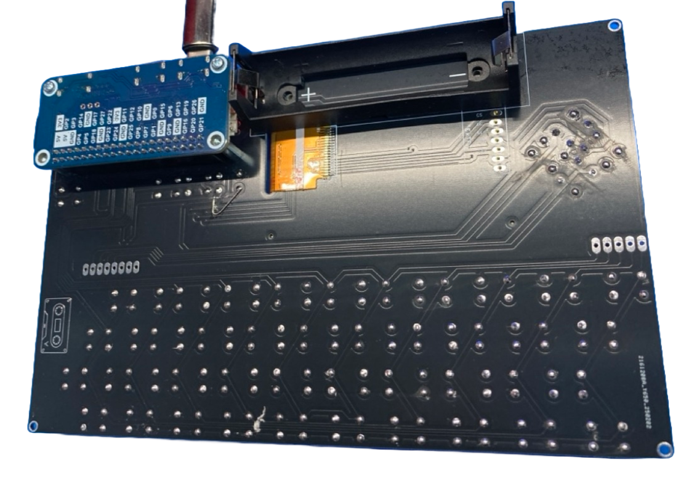

### PICOZX HDMI
This is a target written for Bobricius' PICOZX HDMI with built in LCD 

A Waveshare RP2040-PiZero Development Board plugs into the bottom of the board.

It supports:
* USB keyboard
* Keyboard martix
* USB joysticks
* DVI video
* LCD video (ST7789)
* PWM sound (1 pin) or Monitor
* SPI SD card

By default, the board starts up using the LCD as its display.
To boot into LCD mode hold down the 'fire' button during reset.

Video and audio setting can be changed in the menus and then saved to make defaults.

While on the menu...
* SHIFT-Fire = ESC
* RELOAD = Backspace
* SHIFT-RELOAD = Del

#### Circuit Diagrams
None as yet

#### Firmware
| LCD | Colour Encoding | Colour Channel | VGA | Firmware |
| - | - | - | - | - |
| ST7789 | BGR | Normal | 640x480x60Hz | [ZxSpectrumBobZero_640x480x60Hz.uf2](/uf2-rp2040/ZxSpectrumBobZero_640x480x60Hz.uf2) |
| ST7789 | BGR | Normal | 720x576x50Hz | [ZxSpectrumBobZero_720x576x50Hz.uf2](/uf2-rp2040/ZxSpectrumBobZero_720x576x50Hz.uf2) |

#### Build system notes
The make system has some switches to adapt it to different LCD panels:
| Symbol | Description | PICOZX | ILI19341 |
| ------ | ----------- | ------ | -------- |
| LCD_INVERSE | invert the brightness of the RGB color components | undefined | defined |
| LCD_MIRROR_X | Mirror the LCD output horizontally | defined | undefined |
| LCD_RGB | Use RBG order rather than BGR | undefined |  defined |

#### References
[ILI9341 datasheet](https://cdn-shop.adafruit.com/datasheets/ILI9341.pdf) 
[RP2040-PiZero Development Board](https://www.waveshare.com/rp2040-pizero.htm) 

