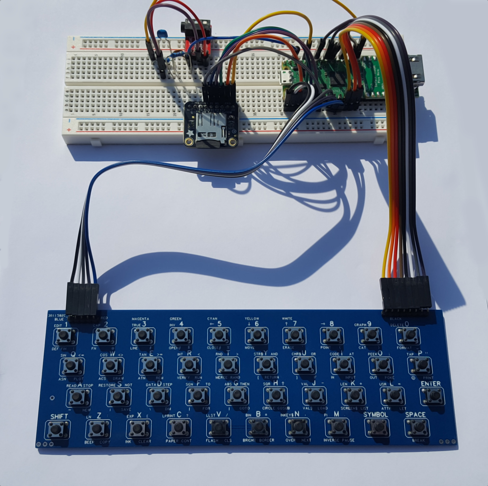
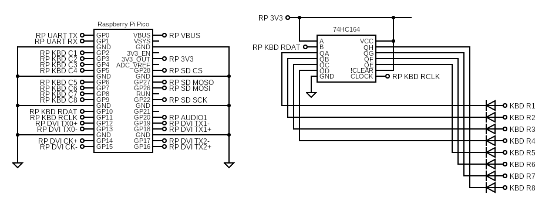

### ZxSpectrumBreadboardHdmiKbd1PinAudio
This is a target similar to the HDMI prototype which can read from an original Spectrum keyboard matrix.

It is a work in progress.

It supports the following:
* USB keyboard
* Matrix keyboard (8x8)
* USB joysticks
* HDMI video
* PWM sound (1 pin)
* SPI SD card

#### Circuit Diagram

I don't know how the original keyboard pins were numbered but mine go from left to right with the keyboard oriented as you would type on it.

#### Firmware
 [ZxSpectrumBreadboardHdmiKbd1PinAudio.uf2](/uf2-rp2040/ZxSpectrumBreadboardHdmiKbd1PinAudio.uf2)