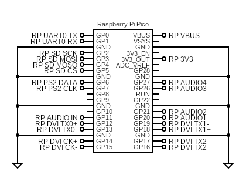

### ZxSpectrumBreadboardHdmiNPinAudio
This is a series of targets based around my original breadboard prototype:

Support for the following:
* USB keyboard
* PS/2 keyboard
* USB joysticks
* HDMI video
* HDMI/PWM audio
* Audio input (load from tape)
* SPI SD card
* Serial port debug

All of these targets share the same pinout but make different use of the 4 audio pins:

#### Circuit diagrams

#### Firmware
| Audio | Firmware |
| - | - |
| HDMI | [ZxSpectrumBreadboardHdmiAudio.uf2](/uf2/ZxSpectrumBreadboardHdmiAudio.uf2) |
| 1 pin PWM | [ZxSpectrumBreadboardHdmi1PinAudio.uf2](/uf2/ZxSpectrumBreadboardHdmi1PinAudio.uf2) |
| 2 pin PWM | [ZxSpectrumBreadboardHdmi2PinAudio.uf2](/uf2/ZxSpectrumBreadboardHdmi2PinAudio.uf2) |
| 4 pin PWM | [ZxSpectrumBreadboardHdmi4PinAudio.uf2](/uf2/ZxSpectrumBreadboardHdmi4PinAudio.uf2) |
