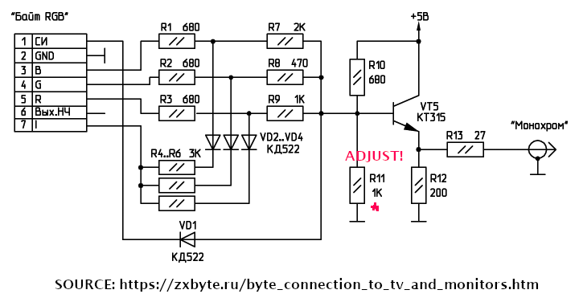

### ZxSpectrumI2SAudioVga1111Ps2_CVBSx50Hz

This is a target based on ZxSpectrum4PinAudioVga1111Ps2 but it generates timings compatible with composite PAL TV. 

It can be connected to a black and white set with a help of this schematic:

Alternatively RGBI outputs can be connected to a PAL modulator.

It supports the following:
* USB keyboard
* PS/2 keyboard (untested)
* USB joysticks
* VGA video (RGBY1111)
* I2S sound
* SPI SD card
* Serial port debug

This target uses I2S DAC (PCM5102).
| Pin | Function |
| - | - |
| 2 | SD SCK |
| 3 | SD MOSI |
| 4 | SD MISO |
| 5 | SD CS |
| 12 | RED |
| 13 | GREEN |
| 14 | BLUE |
| 15 | INTENSITY |
| 16 | CSYNC |
| 26 | I2S DATA |
| 27 | I2S BCLK |
| 28 | I2S LRCK |

#### Firmware

| Display | Audio | Firmware Pico | Firmware Pico 2 |
| - | - | - | - |
| CVBS 50Hz | I2S | [ZxSpectrumI2SAudioVga1111Ps2_CVBSx50Hz](/uf2-rp2040/ZxSpectrumI2SAudioVga1111Ps2_CVBSx50Hz.uf2) | 