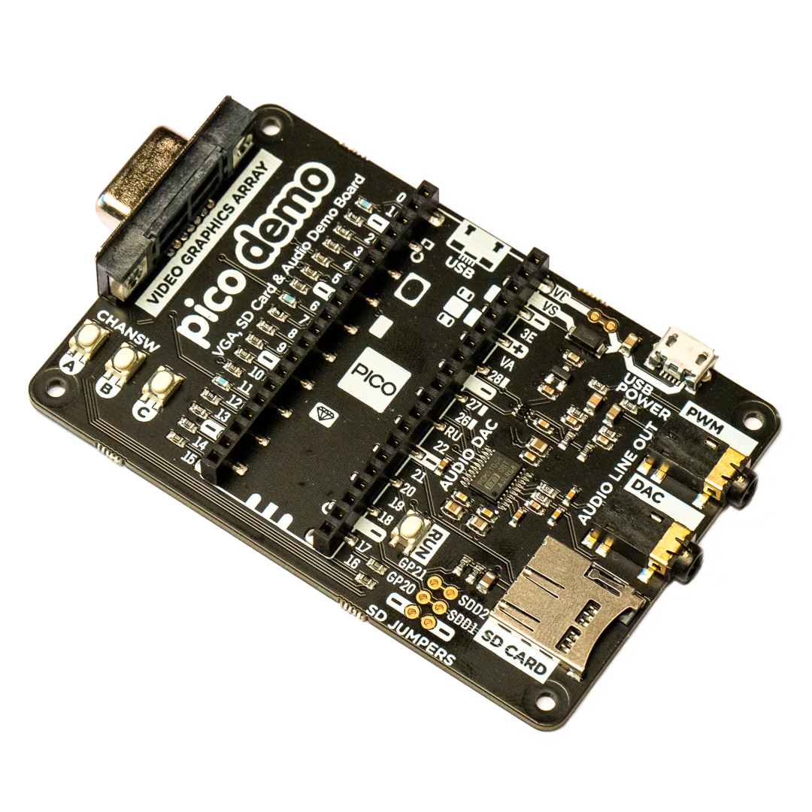

### ZxSpectrumPicoVga



#### Firmware
[ZxSpectrumPicoVga.uf2](/uf2/ZxSpectrumPicoVga.uf2)

Building firmware for the *Pimoroni Pico VGA Demo Base* needs a different cmake command:

```sh
cd build
cmake -DPICO_COPY_TO_RAM=0 -DPICO_BOARD=vgaboard ..
make -j4 ZxSpectrumPicoVga
```

#### Parts
[Pimoroni](https://shop.pimoroni.com/products/pimoroni-pico-vga-demo-base)