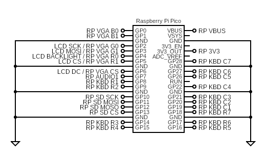

### ZxSpectrumPicomputerZxLcd
This is a target written for Bobricius' PICOZX with built in LCD 

It supports:
* USB keyboard
* Keyboard martix
* USB joysticks
* VGA video (RGB222)
* LCD video (ST7789)
* PWM sound (1 pin)
* SPI SD card

By default, the board starts up using the LCD as its display.
To boot into VGA mode hold down the 'fire' button during reset.
Placing vga.txt on the SD card in the zxspectrum folder changes the default to VGA.

While on the menu...
* SHIFT-Fire = ESC
* RELOAD = Backspace
* SHIFT-RELOAD = Del

#### Circuit Diagram

#### Firmware
[uf2/ZxSpectrumPicomputerVga222Zx.uf2](/uf2/ZxSpectrumPicomputerVga222Zx.uf2)

#### References
[Hackaday](https://hackaday.io/project/186039-pico-zx-spectrum-128k)
[Adafruit](https://blog.adafruit.com/2022/07/27/picozx-is-a-128kb-zx-spectrum-clone-using-a-raspberry-pi-pico-retrocomputing-opensource-pico-dirkdierickx/)
[Hackster](https://www.hackster.io/news/pico-zx-spectrum-128k-is-a-recreation-of-the-sinclair-classic-computer-d51b59bca8d2)

