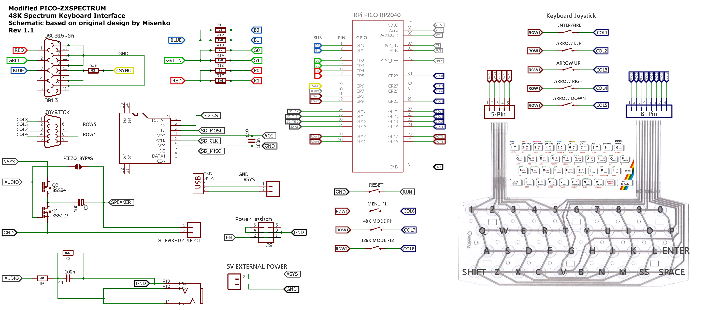

### ZxSpectrumPicomputerVgaAuk

All keys are fully functional and the Emulator Menus can only be accessed via an external button connected to one of the GPIO pins.
The Menu can be navigated using the Spectrum's keyboard number keys. There are an extra 8 external buttons that can been used
for setting the Spectrum ROM boot mode and a Joystick Keyboard.

Please see the Schematic diagram for more information on GPIO pins used.

#### Circuit diagram

#### Firmware

| Display mode | Firmware |
| - | - |
| 720x576x50Hz | [ZxSpectrumPicomputerVgaAuk_720x576x50Hz.uf2](/uf2/ZxSpectrumPicomputerVgaAuk_720x576x50Hz.uf2) |
| 640x480x60Hz | [ZxSpectrumPicomputerVgaAuk_640x480x60Hz.uf2](/uf2/ZxSpectrumPicomputerVgaAuk_640x480x60Hz.uf2) |

#### References

