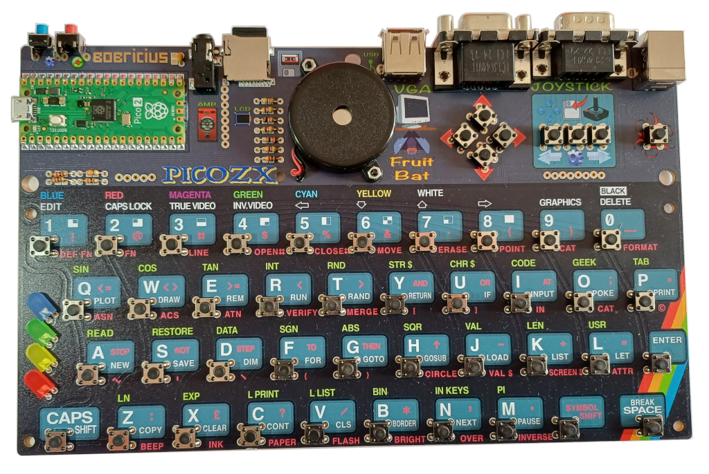

### ZxSpectrumPicomputerZx2Lcd
This is a target written for Bobricius' PICOZX mk 2 with built in LCD 

It supports:
* USB keyboard
* Keyboard martix
* USB joysticks
* VGA video (RGB222)
* LCD video (ST7789)
* PWM sound (1 pin)
* SPI SD card

By default, the board starts up using VGA as its display.
To boot into LCD mode hold down the 'fire' button during reset.
Placing lcd.txt on the SD card in the zxspectrum folder changes the default to LCD.

While on the menu...
* SHIFT-Fire = ESC
* RELOAD = Backspace
* SHIFT-RELOAD = Del

#### Circuit Diagrams
None as yet

#### Firmware
| LCD | Colour Encoding | Colour Channel | VGA | Sock | Firmware |
| - | - | - | - | - | - |
| ST7789 | BGR | Normal | 640x480x60Hz | Pico2 | [ZxSpectrumPicomputerZx2Lcd_640x480x60Hz.uf2](/uf2-rp2350-arm-s/ZxSpectrumPicomputerZx2Lcd_640x480x60Hz.uf2) |
| ST7789 | BGR | Normal | 720x576x50Hz | Pico2 | [ZxSpectrumPicomputerZx2Lcd_720x576x50Hz.uf2](/uf2-rp2350-arm-s/ZxSpectrumPicomputerZx2Lcd_720x576x50Hz.uf2) |

#### Build system notes
The make system has some switches to adapt it to different LCD panels:
| Symbol | Description | PICOZX | ILI19341 |
| ------ | ----------- | ------ | -------- |
| LCD_INVERSE | invert the brightness of the RGB color components | undefined | defined |
| LCD_MIRROR_X | Mirror the LCD output horizontally | defined | undefined |
| LCD_RGB | Use RBG order rather than BGR | undefined |  defined |

#### References
[ILI9341 datasheet](https://cdn-shop.adafruit.com/datasheets/ILI9341.pdf) 

